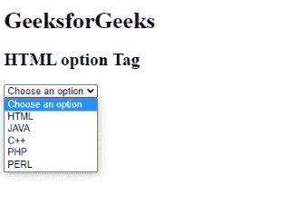
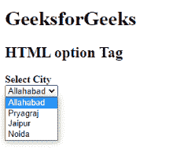

# HTML option 标签

> 原文:[https://www.geeksforgeeks.org/html-option-tag/](https://www.geeksforgeeks.org/html-option-tag/)

HTML 中的<option>标签用于从下拉菜单中选择一个选项。该标签可以使用任何属性，也可以不使用任何属性，所需的值可以发送到服务器。可以使用 [<选项组>标签](https://www.geeksforgeeks.org/html-optgroup-tag/)创建选项组。它创建一组相关的菜单项。</option>

**语法:**

```html
<option> Contents... </option>
```

**属性:**<选项>标签包含下列四个属性:

*   [**禁用**](https://www.w3schools.com/tags/att_option_disabled.asp#:~:text=The%20disabled%20attribute%20is%20a,a%20checkbox%2C%20etc.).) **:** 该属性包含禁用的值，表示选项已禁用。
*   [**标签**](https://www.geeksforgeeks.org/html-option-label-attribute/#:~:text=The%20HTML%20option%20label%20Attribute,in%20the%20drop%2Ddown%20list.&text=Attribute%20Values%3A%20It%20contains%20single,shorter%20version%20for%20an%20option.) **:** 该属性包含代表选项短标签的文本值。
*   [**选中**](https://www.w3schools.com/tags/att_option_selected.asp) **:** 该属性包含选中的值，该值代表浏览器加载时预先选择的项目。
*   [**值**](https://www.w3schools.com/tags/att_option_value.asp) **:** 该属性包含发送到服务器的值文本。

**例 1:**

## 超文本标记语言

```html
<!DOCTYPE html>
<html>

<body>
    <h1>GeeksforGeeks</h1>
    <h2>HTML option Tag</h2>
    <select>
        <!-- option tag starts -->
            <option>Choose an option</option>
            <option value="html">HTML</option>
            <option value="java">JAVA</option>
            <option value="C++">C++</option>
            <option value="php">PHP</option>
            <option value="perl">PERL</option>
        <!-- option tag ends -->
        </select>
</body>

</html>
```

**输出:**



**例 2:**

## 超文本标记语言

```html
<!DOCTYPE html>
<html>

<body>
    <h1>GeeksforGeeks</h1>
    <h2>HTML option Tag</h2>
    <strong>Select City<br></strong>
    <select>
        <!-- option tag starts -->
            <option>Allahabad</option>
            <option>Pryagraj</option>
            <option>Jaipur</option>
            <option>Noida</option>
        <!-- option tag ends     -->
        </select>
</body>

</html>
```

**输出:**



**支持的浏览器:**

*   谷歌 Chrome
*   微软公司出品的 web 浏览器
*   火狐浏览器
*   旅行队
*   歌剧