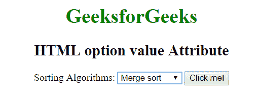
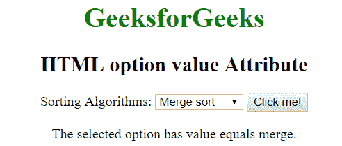

# HTML |选项值属性

> 原文:[https://www.geeksforgeeks.org/html-option-value-attribute/](https://www.geeksforgeeks.org/html-option-value-attribute/)

HTML 中<选项>标签的**值**属性用于指定选项元素的值。

**语法:**

```html
<option value = "value">
```

**属性值:**包含单值**值**，必须发送到服务器。

**示例:**本示例说明了选项标签中的值属性。

```html
<!DOCTYPE html>
<html>
    <head>
        <title>HTML option value Attribute</title>
    </head>

    <body style = "text-align:center">

        <h1 style = "color: green;">
            GeeksforGeeks
        </h1>

        <h2>
            HTML option value Attribute
        </h2>

        Sorting Algorithms:
        <select id="opt">
            <option value="quick">Quick sort</option>
            <option value="merge">Merge sort</option>
            <option value="insertion">Insertion sort</option>
        </select>

        <button type="button" onclick="geek()">
            Click me!
        </button>

        <p id = "p"></p>

        <script>
            function geek() {
                var x = document.getElementById("opt").selectedIndex;
                var y = document.getElementsByTagName("option")[x].value;
                document.getElementById("p").innerHTML = "The selected" 
                + " option has value equals " + y + ".";
            }
        </script>
    </body>
</html>                    
```

**输出:**
**点击按钮前:**

**点击按钮后:**


**支持的浏览器:**选项标签中值属性支持的浏览器如下:

*   苹果 Safari
*   谷歌 Chrome
*   火狐浏览器
*   歌剧
*   微软公司出品的 web 浏览器