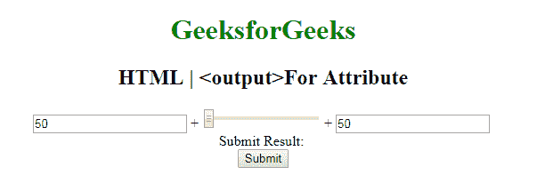

# HTML | output 为属性

> 原文:[https://www.geeksforgeeks.org/html-output-for-attribute/](https://www.geeksforgeeks.org/html-output-for-attribute/)

属性的 **HTML <输出>用于*指定结果和计算*之间的关系。
**语法:**** 

```html
<output for="element_id">
```

**属性值:**它包含一个值，即**元素 _id** ，该值指定了一个或多个元素的 id 的分离列表，这些元素指定了结果和计算之间的关系。
**示例:**这个示例说明了在输出元素中 for 属性的使用。

## 超文本标记语言

```html
<!DOCTYPE html>
<html>

<head>
    <title>
        HTML | For Attribute
    </title>
    <style>
        body {
            text-align: center;
        }

        h1 {
            color: green;
        }
    </style>
</head>

<body>
    <h1>GeeksforGeeks</h1>
    <h2>
      HTML | <output>For Attribute
  </h2>
    <form oninput="sumresult.value = parseInt(A.value)
                + parseInt(B.value) + parseInt(C.value)">
        <input type="number"
               name="A"
               value="50" /> +

        <input type="range"
               name="B"
               value="0" /> +

        <input type="number"
               name="C"
               value="50" />
        <br /> Submit Result:
        <output name="sumresult"
                for="A B C">
        </output>
        <br>
        <input type="submit">
    </form>
</body>

</html>
```

**输出:**



**支持的浏览器:**属性的 **HTML | <输出>支持的浏览器如下:** 

*   谷歌 Chrome
*   火狐浏览器
*   歌剧
*   旅行队
*   微软边缘