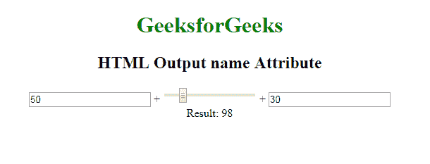

# HTML | output 名称属性

> 原文:[https://www.geeksforgeeks.org/html-output-name-attribute/](https://www.geeksforgeeks.org/html-output-name-attribute/)

**HTML <输出>名称属性**用于*为<输出>元素*指定名称。
用于提交表单后引用表单数据，或者引用 JavaScript 中的元素。

**语法:**

```html
<Output name="text"> 
```

**属性值:**它包含指定<输出>元素名称的值，即名称。

**示例:**

```html
<!DOCTYPE html>
<html>

<head>
    <title>
        HTML Output name Attribute
    </title>
</head>

<body>
    <center>
        <h1 style="color=green">
          GeeksforGeeks
      </h1>
        <h2>HTML Output name Attribute</h2>
        <form oninput="sumresult.value = parseInt(A.value) 
                + parseInt(B.value) + parseInt(C.value)">

            <input type="number" 
                   name="A"
                   value="50" /> +

            <input type="range" 
                   name="B" 
                   value="0" /> +

            <input type="number" 
                   name="C" 
                   value="30" />
            <br> Result:
            <output name="sumresult"></output>
        </form>
    </center>
</body>

</html>
```

**输出:**


**支持的浏览器:**

*   谷歌 Chrome 10.0
*   Firefox 4.0
*   Edge 13.0
*   Opera 11.0
*   苹果 Safari 5.1