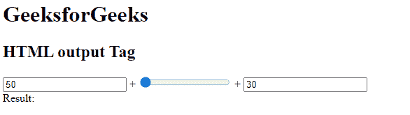
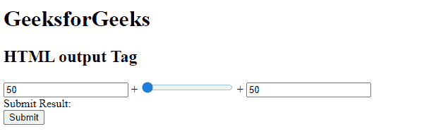

# HTML output 标签

> 原文:[https://www.geeksforgeeks.org/html-output-tag/](https://www.geeksforgeeks.org/html-output-tag/)

HTML 中的

<output>标记用于表示客户端脚本(如 JavaScript)执行的计算结果。

<output>标签是 HTML 5 中的一个新标签，它需要一个开始和结束标签。
</output>

</output>

**语法:**

```html
<output> Results... </output>
```

**属性:**输出标签接受下面列出的三个属性:

*   [](https://www.geeksforgeeks.org/html-output-for-attribute/#:~:text=The%20HTML%20for%20Attribute,the%20result%20and%20the%20calculation.&text=Attribute%20Values%3A%20It%20contains%20a,the%20result%20and%20the%20calculation.)****:**该属性包含一个属性值 *element_id* ，用于指定结果与计算之间的关系。**
*   **[**表单**](https://www.geeksforgeeks.org/html-output-form-attribute/) **:** 该属性包含一个属性值 *form_id* ，用于指定输出元素的一个或多个表单。**
*   **[**名称**](https://www.geeksforgeeks.org/html-output-name-attribute/) **:** 该属性包含一个属性值*名称*，用于指定输出元素的名称。**

****例 1:****

## **超文本标记语言**

```html
<!DOCTYPE html>
<html>

<body>
    <h1>GeeksforGeeks</h1>
    <h2>HTML output Tag</h2>
    <form oninput="sumresult.value = parseInt(A.value) 
                + parseInt(B.value) + parseInt(C.value)">
        <input type="number" name="A" value="50" /> +
        <input type="range" name="B" value="0" /> +
        <input type="number" name="C" value="30" />
        <br>
        <!-- output tag -->
        Result: <output name="sumresult"></output>
    </form>
</body>

</html>
```

****输出:**** 

****

****示例 2:** 在本例中，<输出>标记与 for 和 form 属性一起使用。**

## **超文本标记语言**

```html
<!DOCTYPE html>
<html>

<body>
    <h1>GeeksforGeeks</h1>
    <h2>HTML output Tag</h2>
    <form oninput="sumresult.value = parseInt(A.value) 
                + parseInt(B.value) + parseInt(C.value)">
        <input type="number" name="A" value="50" /> +
        <input type="range" name="B" value="0" /> +
        <input type="number" name="C" value="50" />
        <br /> Submit Result:
        <!-- output tag -->
        <output name="sumresult" for="A B C"></output>
        <br>
        <input type="submit">
    </form>
</body>

</html>
```

****输出:**** 

****

****支持的浏览器:****

*   **谷歌 Chrome 10.0**
*   **Internet Explorer 13.0**
*   **Firefox 4.0**
*   **Opera 11.0**
*   **苹果 Safari 5.1**