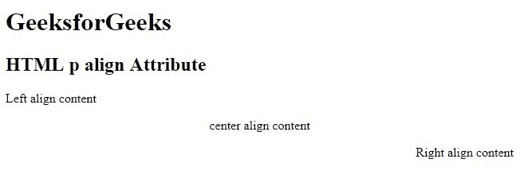

# HTML |

对齐属性

> 原文:[https://www.geeksforgeeks.org/html-p-align-attribute/](https://www.geeksforgeeks.org/html-p-align-attribute/)

**HTML < p >对齐属性**用于*指定段落文本内容的对齐方式*。

**语法:**

```html
<p align="left | right | center | justify">
```

**属性值:**

*   **左:**设置文本左对齐。
*   **右:**设置文本右对齐。
*   **居中:**设置文本居中对齐。
*   **对齐:**拉伸段落文本，使所有行的宽度相等。

**注意:**HTML 5 不支持< p >对齐属性。

**示例:**

```html
<!DOCTYPE html>
<html>

<head>
    <title>
        HTML p align Attribute
    </title>
</head>

<body>
    <h1>GeeksforGeeks</h1>

    <h2>HTML p align Attribute</h2>

    <p align="left">
      Left align content
  </p>
    <p align="center">
      center align content
  </p>
    <p align="right">
      Right align content
  </p>
</body>

</html>
```

**输出:**


**支持的浏览器:**以下列出了 **HTML < p > align 属性**支持的浏览器:

*   谷歌 Chrome
*   微软公司出品的 web 浏览器
*   火狐浏览器
*   旅行队
*   歌剧

HTML 是网页的基础，通过构建网站和网络应用程序用于网页开发。您可以通过以下 [HTML 教程](https://www.geeksforgeeks.org/html-tutorials/)和 [HTML 示例](https://www.geeksforgeeks.org/html-examples/)从头开始学习 HTML。