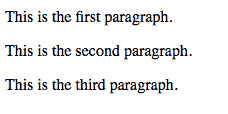
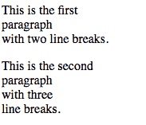
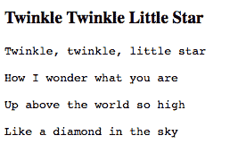

# HTML |段落

> 原文:[https://www.geeksforgeeks.org/html-paragraph-2/](https://www.geeksforgeeks.org/html-paragraph-2/)

我们应该在段落中发布文本的原因有很多，比如短段落吸引更多的读者，它过滤了信息，有助于推动一个观点。

因此，由于在段落中发布文本的以下好处，HTML 也有一个用于相同目的的标签。

标签用于定义段落。这是一个人在网页上发布文本所需的最基本的标签之一。要在段落中发布的文本写在开头的

和结尾的

标签之间。

```html
<!DOCTYPE html>
<html>
<body>

<p>This is the first paragraph.</p>
<p>This is the second paragraph.</p>
<p>This is the third paragraph.</p>

</body>
</html>
```

**输出:**


**关闭段落元素:**
在 HTML 4 和更早的版本中，关闭段落标签不是强制性的。一个段落可以通过使用一个新的段落开始标记来开始。

```html
<!DOCTYPE html>
<html>
<body>

<p>This is the first paragraph.
<p>This is the second paragraph.
<p>This is the third paragraph.

</body>
</html>
```

**输出:**


**段落中的换行符:**
代表换行符的< br >标记用于插入换行符，而不改变段落。

```html
<!DOCTYPE html>
<html>
<body>

<p>This is the first<br> paragraph<br>
                 with two line breaks.</p>
<p>This is the second <br> paragraph<br>
             with three<br>line breaks.</p> 

</body>
</html>
```

**输出:**


**HTML 中的注释:**
添加注释是为了提供有助于理解源代码的额外信息。这通常有助于开发人员将来考虑修改源代码。注释不会显示在输出屏幕中。
一个 HTML 评论以<开头！–并以–>结尾。

```html
<!DOCTYPE html>
<html>
<body>
 <!-- this is an HTML comment -->
 <p>This is the first<br> paragraph<br>
                   with two line breaks.</p>
    <!-- Beginning of second paragraph -->
<p>This is the second <br> paragraph<br>
               with three<br>line breaks.</p> 

</body>
</html>
```

**输出:**


**HTML 中的 PRE 元素:**
<PRE>标签定义了预格式化文本。前置标签保留了前置标签之间的文本中存在的空格和换行符。

```html
<!DOCTYPE html>
<html>
<body>

<h3>Twinkle Twinkle Little Star</h3>

<pre>
Twinkle, twinkle, little star

How I wonder what you are

Up above the world so high

Like a diamond in the sky
</pre>

</body>
</html>
```

**输出:**
