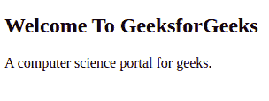

# HTML 段落

> 原文:[https://www.geeksforgeeks.org/html-paragraph/](https://www.geeksforgeeks.org/html-paragraph/)

在本文中，我们将通过示例了解 **HTML 段落**、&及其基本实现。HTML 中的 **< p >** 标签定义了一个段落。这些都有开始和结束标签。所以**<p>****</p>**中提到的任何内容都被视为一个段落。大多数浏览器将一行作为段落阅读，即使我们没有使用结束标记，即< /p >，但这可能会产生意想不到的结果。所以，这既是一个很好的约定，我们**必须**使用结束标记。

**语法:**

```html
<p> Content </p>
```

**示例 1:** 在本例中，我们使用的是用于 HTML 中段落的< p >标记。

## 超文本标记语言

```html
<!DOCTYPE html>
<html>

<body>
    <h2>Welcome To GeeksforGeeks</h2>

    <!-- Use of <p> tag -->
    <p>A computer science portal for geeks.</p>

</body>

</html>
```

**输出:**



HTML p 标签

**例 2** :这个例子解释了 HTML < p >标签。

## 超文本标记语言

```html
<!DOCTYPE html>
<html>

<body>
    <p>A Computer Science portal for geeks.</p>
    <p>It contains well written, well thought articles.</p>

</body>

</html>
```

**输出**:


多个

标签

**要点:**我们看网页的时候，看到一个段落前后加的空格很少。默认情况下，HTML 会这样做。让我们看看段落标记的一些属性:

*   如前所述，

    标签会自动在任何段落前后添加空格，这基本上是浏览器添加的边距。

*   如果用户添加了多个空格，浏览器会将它们缩减为一个空格。
*   如果用户添加了多行，浏览器会将其缩减为一行。

**示例:**这个示例解释了具有多行的 HTML < p >标签。

## 超文本标记语言

```html
<!DOCTYPE html>
<html>

<body>
    <p>
        This paragraph has multiple lines.
        But HTML reduces them to a single line,
        omitting the carriage return we have used.
    </p>

    <p> 
        This paragraph has multiple spaces.
        But HTML reduces them all to a single
        space, omitting the extra spaces and line we have used.
    </p>

</body>

</html>
```

**输出**:


用多行标记

[**< br >标签:**](https://www.geeksforgeeks.org/html-brgt-tag/) 通过使用 **< br >** 标签，有一种方法可以让 HTML 知道浏览器需要在哪里更改行。这些标记没有任何结束标记。所以，只要一个开始标记就可以改变线条。

**语法:**

```html
 <br> 
```

**示例**:本示例解释了在< p >标签中添加换行的< br >标签。

## 超文本标记语言

```html
<!DOCTYPE html>
<html>

<body>
    <p> 
        This paragraph has multiple
        <br />lines. But HTML reduces them
        <br />to a single line, omitting
        <br />the carriage return we have used. 
    </p>

</body>

</html>
```

**输出**:


在

标签内使用
标签

[**对齐属性**](https://www.geeksforgeeks.org/html-p-align-attribute/)**:**<p>标签专门支持对齐属性，允许我们将段落左对齐、右对齐或居中对齐。

**语法:**

```html
<p align="value">
```

**示例**:本示例解释了对齐属性以对齐< p >标签中的内容。

## 超文本标记语言

```html
<!DOCTYPE html>
<html>

<body>
    <p align="center">Welcome Geeks</p>

    <p align="left">A Computer Science portal for geeks.</p>

    <p align="right">It contains well written, well thought articles.</p>

</body>

</html>
```

**输出**:


在

标签中使用对齐属性

[**< pre >标记**](https://www.geeksforgeeks.org/html-pre-tag/) **:** 我们已经看到段落标记如何忽略段落内的所有行和多余空格的变化，但是有一种方法可以通过使用 **< pre >** 标记来保留这一点。它还包含一个开始标记和一个结束标记。它在固定的高度和宽度内显示文本，并保留我们使用的额外的行和空格。

**语法:**

```html
<pre> Content </pre> 
```

**示例**:本示例解释了< p >标签中< pre >标签的用法。

## 超文本标记语言

```html
<!DOCTYPE html>
<html>

<body>
  <pre>
    This paragraph has multiple
    lines. But it is displayed 
    as it is unlike the paragraph 
    tag.
    </pre>

  <pre>
    This     paragraph has multiple
    spaces. But     it is displayed 
    as it is    unlike the paragraph 
         tag.
    </pre>
</body>

</html>
```

**输出**:


在

标签中使用

```html
标签
```

**支持的浏览器:**

*   谷歌 Chrome
*   微软公司出品的 web 浏览器
*   微软边缘
*   火狐浏览器
*   歌剧
*   旅行队