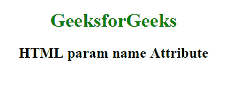

# HTML |参数名属性

> 原文:[https://www.geeksforgeeks.org/html-param-name-attribute/](https://www.geeksforgeeks.org/html-param-name-attribute/)

**HTML 参数名称属性**用于*指定一个<参数>元素*的名称。该属性与值属性一起用于定义与<对象>元素相关联的插件参数。
**语法:**

```html
<param name="name"> 
```

**属性值:**它包含指定<参数>元素名称的值，即名称。
**例:**

## 超文本标记语言

```html
<!DOCTYPE html>
<html>

<head>
    <title>param tag</title>
    <style>
        body {
            text-align: center;
        }

        h1 {
            color: green;
        }
    </style>
</head>

<body>
    <h1>GeeksforGeeks</h1>
    <h2>HTML param name Attribute</h2>
    <object data="sample.mp4">
        <param name="video" value="play">
    </object>
</body>

</html>
```

**输出:**



**支持的浏览器:**

*   谷歌 Chrome
*   火狐浏览器
*   边缘
*   歌剧
*   苹果 Safari