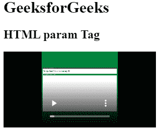
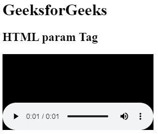

# HTML <param>标签

> 哎哎哎:# t0]https://www . geeksforgeeks . org/html-param-tag/

HTML 中的<param>标签用于定义与 [<对象>](https://www.geeksforgeeks.org/html-object-tag/) 元素关联的插件参数。它不包含结束标记。

**语法:**

```html
<param name="" value="">
```

**属性:**这个标签接受四个属性，描述如下。

*   [**名称**](https://www.geeksforgeeks.org/html-param-name-attribute/#:~:text=The%20HTML%20param%20name%20Attribute,associated%20with%20element.&text=Attribute%20Values%3A%20It%20contains%20the,for%20the%20element.) **:用于指定参数的名称。**
*   [**值**](https://www.geeksforgeeks.org/html-param-value-attribute/) **:用于指定参数的值。**
*   [**类型**](https://www.geeksforgeeks.org/html-type-attribute/) **:用于指定媒体类型。**
*   **值类型:**用于指定值的类型。

**注意:**html 5 不支持类型和值类型属性。
T3】例 1:

## 超文本标记语言

```html
<!DOCTYPE html>
<html>
<body>
    <h1>GeeksforGeeks</h1>
    <h2>HTML param Tag</h2>
    <object data=
"https://media.geeksforgeeks.org/wp-content/uploads/20210209234048/InShot_20210209_233841711.mp4">
        <param name="video" value="play">
    </object>
</body>
</html>                                
```

**输出:**



**例 2:**

## 超文本标记语言

```html
<!DOCTYPE html>
<html>
<body>
    <h1>GeeksforGeeks</h1>
    <h2>HTML param Tag</h2>
    <object data=
"https://media.geeksforgeeks.org/wp-content/cdn-uploads/20200430164710/captured_voice.mp3">
        <param name="video" value="play">
    </object>
</body>
</html>
```

**输出:**



**支持的浏览器:**

*   谷歌 Chrome
*   微软公司出品的 web 浏览器
*   火狐浏览器
*   歌剧
*   旅行队