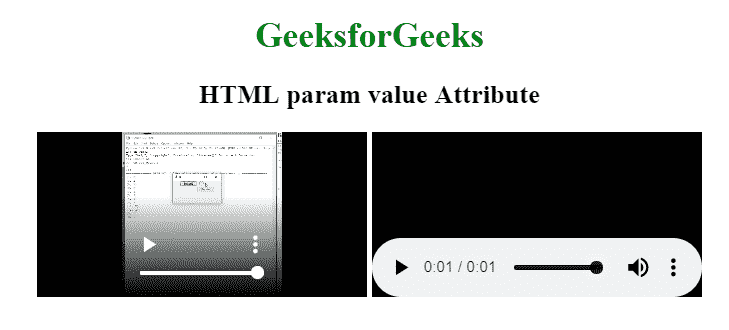

# HTML | <param>值属性

> 原文:[https://www.geeksforgeeks.org/html-param-value-attribute/](https://www.geeksforgeeks.org/html-param-value-attribute/)

**HTML <参数>值属性**用于指定 *<参数>* 元素的值。该属性与 name 属性一起用于定义与元素关联的插件的参数。

**语法:**

```html
<param value="value">
```

**属性:**

*   **值:**用于指定参数元素的值。

以下示例说明了值属性在<param>元素中的使用:

**示例:**

```html
<!DOCTYPE html>
<html>

<head>
    <title>
        HTML param value Attribute
    </title>

    <style>
        body {
            text-align: center;
        }

        h1 {
            color: green;
        }
    </style>
</head>

<body>
    <h1>GeeksforGeeks</h1>

    <h2>HTML param value Attribute</h2>

    <object data=
"https://media.geeksforgeeks.org/wp-content/uploads/20190626010302/ice_video_20190626-005104_edit_0.mp4">
        <param name="video" value="play">
    </object>

    <object data=
"https://media.geeksforgeeks.org/wp-content/uploads/20190625154423/1-1.wav">
        <param name="audio" value="play">
    </object>

</body>

</html>                    
```

**输出:**


**支持的浏览器:**HTML<参数>值属性支持的浏览器如下:

*   谷歌 Chrome
*   微软公司出品的 web 浏览器
*   火狐浏览器
*   旅行队
*   歌剧