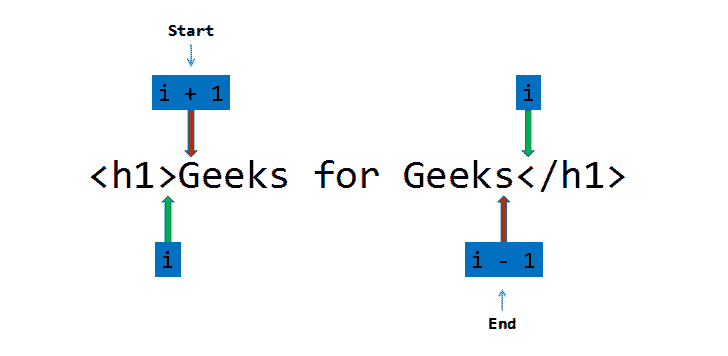

# C/c++中的 HTML 解析器

> 原文:[https://www.geeksforgeeks.org/html-parser-in-c-cpp/](https://www.geeksforgeeks.org/html-parser-in-c-cpp/)

[HTML Parser](https://www.geeksforgeeks.org/html-parsing-and-processing/) 是一个可以提取有用语句的程序/软件，留下 [html](https://www.geeksforgeeks.org/html-tutorials/) 标签(像< h1 >、< span >、< p >等)。

**示例:**

> **输入:** < h1 >极客为极客< /h1 >
> **输出:**极客为极客
> **解释-** < h1 >和< /h1 >为开、闭标题标签，因此得到解析，留下“极客为极客”作为输出。
> 
> **输入:**<p>Geeks for Geeks</p>
> **输出:** Geeks for Geeks
> **解释-** < p >和< /p >为开、闭段落标记，因此被解析，解析器忽略空格字符，留下“Geeks for Geeks”作为输出。

**方法:**让输入字符串为大小为 n 的 S，按照以下步骤解决问题:

*   声明两个[变量](https://www.geeksforgeeks.org/variables-and-keywords-in-c/)、*开始*和*结束* 指向语句的起点和终点。
*   [遍历字符串](https://www.geeksforgeeks.org/iterate-over-characters-of-a-string-in-c/)，S 使用变量 i ，如果 S【I】等于“>”，则将 *start* 变量更新为 i+1，[跳出循环](https://www.geeksforgeeks.org/break-statement-cc/)。
*   当 S[start]等于“”时，通过运行循环从开始处删除空格，并在每次迭代中将 *start* 变量增加 1。
*   再次遍历字符串，S 从开始使用变量 I，如果 S[i]等于'
*   运行一个循环，打印范围[开始，结束]内的字符串。



以下是上述方法在 **C 语言**中的实现:

```html
// C program for the above approach

#include <stdbool.h>
#include <stdio.h>
#include <string.h>

// Function to parse the HTML code
void parser(char* S)
{
    // Store the length of the
    // input string
    int n = strlen(S);
    int start = 0, end = 0;
    int i, j;

    // Traverse the string
    for (i = 0; i < n; i++) {
        // If S[i] is '>', update
        // start to i+1 and break
        if (S[i] == '>') {
            start = i + 1;
            break;
        }
    }

    // Remove the blank spaces
    while (S[start] == ' ') {
        start++;
    }

    // Traverse the string
    for (i = start; i < n; i++) {
        // If S[i] is '<', update
        // end to i-1 and break
        if (S[i] == '<') {
            end = i - 1;
            break;
        }
    }

    // Print the characters in the
    // range [start, end]
    for (j = start; j <= end; j++) {
        printf("%c", S[j]);
    }

    printf("\n");
}

// Driver Code
int main()
{
    // Given Input
    char input1[] = "<h1>This is a statement</h1>";
    char input2[] = "<h1>         This is a statement with some spaces</h1>";
    char input3[] = "<p> This is a statement with some @ #$ ., / special characters</p>         ";

    printf("Parsed Statements:\n");

    // Function Call
    parser(input1);
    parser(input2);
    parser(input3);

    return 0;
}
```

**Output:**

```html
Parsed Statements:
This is a statement
This is a statement with some spaces
This is a statement with some @ #$ ., / special characters

```

以下是上述方法在 **C++语言**中的实现:

```html
// C++ program for the
// above approach
#include <bits/stdc++.h>
using namespace std;

// Function to parse the
// HTML code
void parser(char* S)
{
    // Store the length of the
    // input string
    int n = strlen(S);
    int start = 0, end = 0;

    // Traverse the string
    for (int i = 0; i < n; i++) {
        // If S[i] is '>', update
        // start to i+1 and break
        if (S[i] == '>') {
            start = i + 1;
            break;
        }
    }

    // Remove the blank space
    while (S[start] == ' ') {
        start++;
    }

    // Traverse the string
    for (int i = start; i < n; i++) {
        // If S[i] is '<', update
        // end to i-1 and break
        if (S[i] == '<') {
            end = i - 1;
            break;
        }
    }

    // Print the characters in the
    // range [start, end]
    for (int j = start; j <= end; j++) {
        cout << S[j];
    }

    cout << endl;
}

// Driver Code
int main()
{
    // Given Input
    char input1[] = "<h1>This is a statement</h1>";
    char input2[] = "<h1>         This is a statement with  some spaces</h1>";
    char input3[] = "<p> This is a statement with some @ #$ ., / special characters</p>         ";

    cout << "Parsed Statements:\n";

    // Function Call
    parser(input1);
    parser(input2);
    parser(input3);
    return 0;
}
```

**Output:**

```html
Parsed Statements:
This is a statement
This is a statement with  some spaces
This is a statement with some @ #$ ., / special characters

```

[**时间复杂度**](https://www.geeksforgeeks.org/understanding-time-complexity-simple-examples/):*O(N)
[**辅助空间**](https://www.geeksforgeeks.org/g-fact-86/) : O(1)*

***注意:**这个程序一次只解析一条语句。*