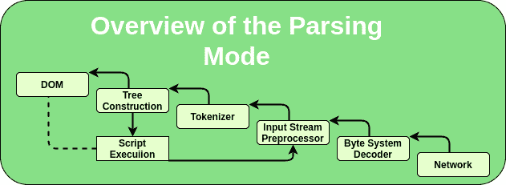

# HTML |解析和处理

> 原文:[https://www.geeksforgeeks.org/html-parsing-and-processing/](https://www.geeksforgeeks.org/html-parsing-and-processing/)

在开始介绍概念之前，让我们详细了解一下术语。单词分析的意思是把某物分成它的组成部分，然后描述它们的句法角色。文字处理是一个熟悉的词，代表用标准的程序处理某事。这两者结合起来解释了 HTML 解析器如何从文本/html 资源中生成 DOM 树。

这种方法定义了 HTML 文档的解析规则，以确定它们在语法上是否正确。语法不匹配的点会引发解析错误。在过程的最后，如果一个资源被确定在 HTML 语法中，那么它就是一个 HTML 文档。

**解析模型概述**

HTML 解析过程的输入由一个代码点流组成，然后通过标记化阶段，接着是树构建阶段，生成一个 Document 对象作为输出。令牌化阶段处理的数据大多来自网络，但也可能来自用户代理中运行的脚本，例如使用 document.write() API。令牌化器和树构建阶段只有一组状态，但是当树构建阶段使用一个令牌时，令牌化器可以恢复。因为这种树的构建阶段通常被认为是可重入的。为了处理这种情况，解析器有一个脚本嵌套级别，它最初必须设置为 0，还有一个解析器暂停标志，它必须初始化为 false。

**PARSE ERRORS:** 如前所述，解析资源时，会检查其语法，如果有不符合标准协议的地方，就会引发 PARSE 错误。如果发现某个资源没有错误，它就会变成一个文档。解析错误只处理关于 HTML 文档语法的错误。除了检查解析错误，一致性检查器还验证文档以匹配基本的一致性要求。解析错误的错误处理是明确定义的。如果在文档中发现一个或多个解析条件，一致性检查器有责任至少报告其中一个条件，如果没有出现错误，则不报告任何条件。如果在文档中遇到多个解析错误条件，一致性检查器可能会报告多个解析错误条件。

**理解每一层**

*   **The input byte stream:**
    The stream of code points that will be the input for the tokenization stage will be initially seen by the user agent as a stream of byte typically coming from a network or a from a local file system. The bytes encode the actual characters as per a particular character encoding, which the user agent uses to decode the bytes into characters.

    给定字符编码，输入字节流中的字节必须转换为字符，以便在标记器作为其输入流时使用，绕过输入字节流和字符编码进行解码。

    当 HTML 解析器对输入字节流进行解码时，它会使用字符编码和暂定的、确定的或不相关的置信度。在解析过程中，使用的编码以及该编码的可信度类型来确定是否更改编码。如果不需要编码，例如因为解析器对 Unicode 流进行操作，并且根本不需要使用字符编码，那么置信度就无关紧要了。

*   **输入流预处理器:**输入流由输入字节流解码时推入其中的字符组成，或者由直接操作输入流的各种 API 组成。在标记化阶段之前，新行在输入流中被规范化。最初，下一个输入字符是输入中尚未消耗的第一个字符，而当前输入字符是已经消耗的最后一个字符。插入点是实际插入使用()插入的内容的位置。插入点不是输入流的绝对偏移量，而是相对于紧接其后的字符位置。最初，插入点是未定义的。
*   **Tokenization:** Implementations are expected to act as if they are using the following state machine to tokenize HTML. The state machine is expected to start in a data state. Most states take a single character, which either switches the state machine to a new state to re-consume the current input character or switches it to a new state to consume the next character. Some states have more complicated behavior and can take in several characters before switching to another state. In some cases, the tokenizer state is also affected by the tree construction stage.

    该步骤中生成的输出是一系列零个或多个以下标记:DOCTYPE、开始标记、结束标记、注释、字符、文件结尾。同样，创建和发出令牌是两个完全不同的概念。当令牌发出时，树构建阶段必须立即关注它。树构建阶段会影响标记化阶段的状态，甚至允许向流中插入额外的字符。

*   **树构建:**来自标记化状态的标记序列形成树构建阶段的输入。一旦创建了解析器，树构建阶段就与文档对象模型相关联了。这个阶段的输出包括动态修改或扩展文档的 DOM 树。当每个令牌从令牌化器中发出时，用户代理需要遵循特定的算法来处理它们。