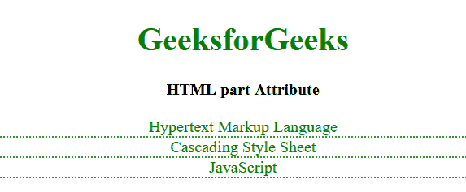

# HTML 部分属性

> 原文:[https://www.geeksforgeeks.org/html-part-attribute/](https://www.geeksforgeeks.org/html-part-attribute/)

HTML 部分属性是一个全局属性，可用于允许 CSS 通过::部分伪元素选择阴影树中的特定元素并设置其样式。

**语法:**

```html
part="tab"
```

**示例:**

## 超文本标记语言

```html
<!DOCTYPE html>
<html>

<head>
    <style type="text/css">
        h1 {
            color: green;
        }

        tabbed-custom-element::part(tab) {
            color: green;
            border-bottom: dotted 2px;
            width: 400px;
        }
    </style>
</head>

<body>
    <center>
        <h1>GeeksforGeeks</h1>
        <strong>HTML part Attribute</strong>
        <br><br>
        <template id="tabbed-custom-element">
            <div part="tab">Hypertext Markup Language</div>
            <div part="tab active">Cascading Style Sheet</div>
            <div part="tab">JavaScript</div>
        </template>
        <tabbed-custom-element></tabbed-custom-element>
    </center>

    <script>

        // Using the selector to select the 
        // part attributes elements
        let template = document
            .querySelector("#tabbed-custom-element");

        globalThis.customElements.define(
            template.id, class extends HTMLElement {
            constructor() {
                super();
                this.attachShadow({ mode: "open" });
                this.shadowRoot.appendChild(template.content);
            }
        });
    </script>
</body>

</html>
```

**输出:**



**支持的浏览器:**

*   谷歌 Chrome
*   火狐浏览器
*   旅行队
*   歌剧
*   边缘