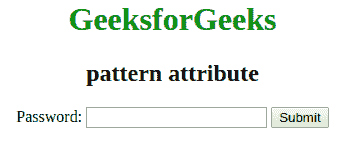

# HTML |模式属性

> 原文:[https://www.geeksforgeeks.org/html-pattern-attribute/](https://www.geeksforgeeks.org/html-pattern-attribute/)

此属性用于指定检查输入元素值的正则表达式。该属性适用于以下输入类型:文本、密码、日期、搜索、电子邮件等。使用全局标题属性来描述帮助用户的模式。

**语法:**

```html
<input pattern = "regular_exp">
```

**元素:**该属性仅与 [<输入>](https://www.geeksforgeeks.org/html-input-pattern-attribute/?ref=rp) 元素关联。

**属性:**该属性指定正则表达式。

**示例:**

```html
<!DOCTYPE html>
<html>
    <head>
        <title>pattern attribute</title>
        <style>
            body {
                text-align:center;
            }
            h1 {
                color:green;
            }
        </style>
    </head>
    <body>
        <h1>GeeksforGeeks</h1>
        <h2>pattern attribute</h2>
        <form action="#">
            Password: <input type="text" name="Password"
            pattern="[A-Za-z]{3}" title="3 letter Password">
        <input type="submit">
        </form>
    </body>
</html>                    
```

**输出:**


**支持的浏览器:**模式属性支持的浏览器如下:

*   谷歌 Chrome 5.0 及以上版本
*   Internet Explorer 10.0 及以上版本
*   Firefox 4.0 及以上版本
*   Opera 9.6 及以上