# HTML 短语标签

> 原文:[https://www.geeksforgeeks.org/html-phrase-tag/](https://www.geeksforgeeks.org/html-phrase-tag/)

**短语标签:**在 HTML 中，短语标签用于指示一段文本的结构意义。例如，缩写标记表示短语包含缩写词。短语标签的一些例子是缩写、强名称、标记、。。。等等。
**强调文本:**em 标签用于强调文本，该标签在浏览器中显示斜体字体。它只是意味着写在 **em** 标签中的任何内容都显示为强调文本。
**语法:**

```html
<em> Text Content </em>
```

**例:**

## 超文本标记语言

```html
<!DOCTYPE html>
<html>
    <body>

        <h1>GeeksforGeeks</h1>
         <!-- em tag is used in below paragraph-->

<p><em>GeeksforGeeks</em> emphasized tag</p>

    </body>
</html>                   
```

**输出:**

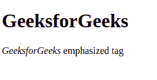

**文本缩写:**要在 HTML 中缩写文本，请使用**缩写**标签。写在开头和结尾缩写标记内的文本缩写。
**语法:**

```html
<abbr title = "GeeksforGeeks">GFG</abbr>
```

**例:**

## 超文本标记语言

```html
<!DOCTYPE html>
<html>
    <body>

        <h1>GeeksforGeeks</h1>
         <!-- abbr tag is used in below paragraph-->

<p><abbr title = "GeeksforGeeks">GFG</abbr>
                               abbreviation tag</p>

    </body>
</html>                   
```

**输出:**

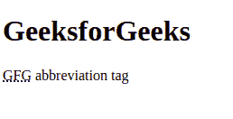

**首字母缩略词元素**这个标签用来表示内容写在开头里面，而结尾**首字母缩略词标签**是一个首字母缩略词。
**语法:**

```html
<acronym> Text Content </acronym>
```

**例:**

## 超文本标记语言

```html
<!DOCTYPE html>
<html>
    <body>

        <h1>GeeksforGeeks</h1>
         <!-- acronym tag is used in below paragraph-->

<p><acronym>GeeksforGeeks</acronym> acronym tag</p>

    </body>
</html>                   
```

**输出:**

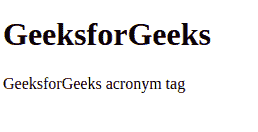

**文本方向:****bdo**标签代表双向覆盖。它用于覆盖当前文本方向。默认文本方向是从左到右。但是它可以通过使用 bdo 标记来覆盖。

*   ltr:指定从左到右的文本方向。
*   rtl:指定从右向左的文本方向。
*   自动:在这个标签中，浏览器根据内容计算出文本方向(仅在文本方向未知的情况下推荐)。

**语法:**

```html
<bdo dir = "ltr/rtl/auto"> Text Content </bdo>
```

**例:**

## 超文本标记语言

```html
<!DOCTYPE html>
<html>
    <body>

        <h1>GeeksforGeeks</h1>

<p>GeeksforGeeks text decoration tag</p>

        <bdo dir = "rtl">GeeksforGeeks text decoration tag</bdo>

    </body>
</html>                   
```

**输出:**

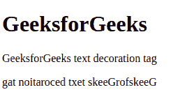

**短引语:**要在句子中添加双引号，请使用 **q** 标记。内容写在启闭 **q** 标签里面会用引号打印出来。
**语法:**

```html
<q> Text Content </q>
```

**示例:**

## 超文本标记语言

```html
<!DOCTYPE html>
<html>
    <body>

        <h1>GeeksforGeeks</h1>

         <!-- q tag is used in below paragraph-->

<p><q>GeeksforGeeks</q> quotation tag</p>

    </body>
</html>                   
```

**输出:**

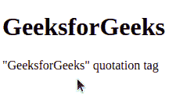

**标记文字:**开闭**标记标签**内写入的内容将显示为黄色标记。基本上，它像荧光笔一样工作，用于突出句子中的一些单词。
**句法:**
**<标记>文字内容</标记>**
**例:**

## 超文本标记语言

```html
<!DOCTYPE html>
<html>
    <body>

        <h1>GeeksforGeeks</h1>

         <!-- mark tag is used in below paragraph-->

<p><mark>GeeksforGeeks</mark> mark tag</p>

    </body>
</html>                   
```

**输出:**

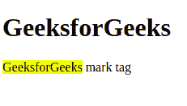

**强文本:****强**标记用于显示句子中的重要单词。在打开和关闭**强标签**内写入的内容将显示为重要词汇。
**语法:**

```html
<strong> Text Content </strong>
```

**示例:**

## 超文本标记语言

```html
<!DOCTYPE html>
<html>
    <body>

        <h1>GeeksforGeeks</h1>

         <!-- strong tag is used in below paragraph-->

<p><strong>GeeksforGeeks</strong> strong tag</p>

    </body>
</html>                   
```

**输出:**

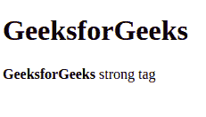

**引用文本:****区块引用标签**用于引用句子。这意味着在开始和结束 blockquote 标记之间写入的内容将被视为引用文本。
**语法:**

```html
<blockquote> Text Content </blockquote>
```

**示例:**

## 超文本标记语言

```html
<!DOCTYPE html>
<html>
    <body>

        <h1>GeeksforGeeks</h1>

         <!-- blockquote tag is used here-->
         <blockquote>GeeksforGeeks is a computer science
        portal where you can learn programming. It contains
        well written, well thought and well explained
        computer science and programming articles, quizzes
        and ...</blockquote>

    </body>
</html>                   
```

**输出:**

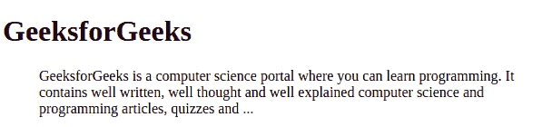

**编程代码:**用 HTML strong 代码标签表示编程代码。开闭**代码标签**内写的内容视为编程代码。
**语法:**

```html
<code> Text Content </code>
```

**示例:**

## 超文本标记语言

```html
<!DOCTYPE html>
<html>
    <body>

        <h1>GeeksforGeeks</h1>

         <!-- code tag is used in below paragraph-->

<p><code>GeeksforGeeks Programming</code> code tag</p>

    </body>
</html>                   
```

**输出:**

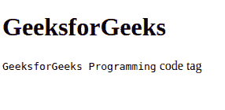

**程序输出:**用**采样标签**编写的程序输出。在打开和关闭**样本标签**内写入的内容将打印样本输出。
**语法:**

```html
<samp> Text Content </samp>
```

**例:**

## 超文本标记语言

```html
<!DOCTYPE html>
<html>
    <body>

        <h1>GeeksforGeeks</h1>

         <!-- samp tag is used in below paragraph-->

<p><samp>GeeksforGeeks</samp> program output tag</p>

    </body>
</html>                   
```

**输出:**

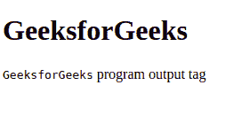

**地址文本:****地址标签**用于在网页浏览器中显示地址。在打开和关闭**地址标签**内写入的内容被认为是 HTML 中的地址。
**语法:**

```html
<address> Text Content </address>
```

**示例:**

## 超文本标记语言

```html
<!DOCTYPE html>
<html>
    <body>

        <h1>GeeksforGeeks</h1>

         <!-- html address tag is used here-->
         <address>GeeksforGeeks office,
                 sector-142, Noida,
                 India</address>

    </body>
</html>                   
```

**输出:**

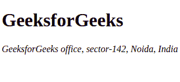

**支持的浏览器:**

*   谷歌 Chrome
*   微软公司出品的 web 浏览器
*   火狐浏览器
*   歌剧
*   旅行队