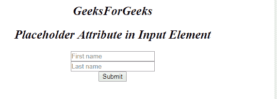
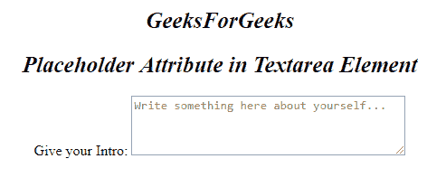

# HTML |占位符属性

> 原文:[https://www.geeksforgeeks.org/html-placeholder-attribute/](https://www.geeksforgeeks.org/html-placeholder-attribute/)

占位符属性指定描述输入字段/文本区域的预期值的简短提示。在用户输入值之前，短提示会显示在字段中。
**语法:**

```html
<element placeholder="">
```

**元素:**这个方法可以有以下属性:

*   [<输入>占位符属性](https://www.geeksforgeeks.org/html-input-placeholder-attribute/?ref=rp)
*   [<文本区>占位符属性](https://www.geeksforgeeks.org/html-textarea-placeholder-attribute/?ref=rp)

**属性:**上述每个元素的属性都是*占位符*。
**例:**用<输入>元素

## 超文本标记语言

```html
<!DOCTYPE html>
<html>

<body>
    <center>
        <h1 style="font-size:25px;font-style:italic;">
            GeeksforGeeks
        </h1>
        <h2 style="font-size:25px;font-style:italic;">
        Placeholder Attribute in Input Element
        </h2>
        <form action=" ">
            <input type="text" name="fname"
                            placeholder="First name">
            <br>
            <input type="text" name="lname"
                            placeholder="Last name">
            <br>
            <input type="submit" value="Submit">
        </form>
</center>
</body>

</html>
```

**输出:**



**示例:**带<文本区>元素

## 超文本标记语言

```html
<!DOCTYPE html>
<html>

<body>
    <center>
        <h1 style="font-size:25px;font-style:italic;">
        GeeksForGeeks
        </h1>
        <h2 style="font-size:25px;font-style:italic;">
        Placeholder Attribute in Textarea Element
        </h2>
        Give your Intro:
        <textarea rows="4" cols="40"
        placeholder="Write something here about yourself...">
        </textarea>
</center>
</body>

</html>
```

**输出:**



**支持的浏览器:**占位符属性支持的浏览器如下:

*   谷歌 Chrome
*   微软公司出品的 web 浏览器
*   火狐浏览器
*   歌剧
*   旅行队