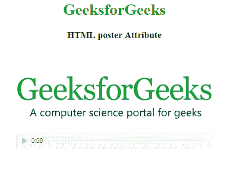

# HTML |海报属性

> 原文:[https://www.geeksforgeeks.org/html-poster-attribute/](https://www.geeksforgeeks.org/html-poster-attribute/)

**HTML 海报属性**用于在视频下载时或用户点击播放按钮时*显示图像。如果这个图像没有设置，那么它将把视频的第一帧作为海报图像。
**适用:**
主要用于 [**<视频>**](https://www.geeksforgeeks.org/html-video-poster-attribute/) 元素。
**语法:*** 

```html
<video poster="URL">
```

**属性值:**包含一个单值 URL，指定源图像的链接。以下列出了两种类型的网址链接:

*   **绝对 URL:** 指向另一个网页。
*   **相对 URL:** 指向同一网页的其他文件。

**例:**

## 超文本标记语言

```html
<!DOCTYPE html>
<html>

<head>
    <title>
    HTML video poster Attribute
</title>
</head>

<body>
    <center>
        <h1 style="color:green;">
        GeeksforGeeks
    </h1>

        <h3>HTML poster Attribute</h3>

        <video width="400"
            height="200"
            controls poster=
"https://media.geeksforgeeks.org/wp-content/uploads/20190627130930/a218.png">

            <source src=
"https://media.geeksforgeeks.org/wp-content/uploads/20190616234019/Canvas.move_.mp4"
                    type="video/mp4">
            <source src=
"https://media.geeksforgeeks.org/wp-content/uploads/20190616234019/Canvas.move_.ogg"
                    type="video/ogg">
        </video>
    </center>
</body>

</html>
```

**输出:**



**支持的浏览器:****HTML 海报属性**支持的浏览器如下:

*   谷歌 Chrome 4.0
*   Internet Explorer 9.0
*   Firefox 3.5
*   苹果 Safari 4.0
*   歌剧 10.5