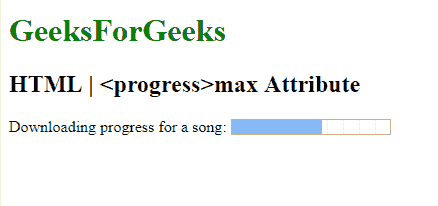

# HTML | progress 最大属性

> 原文:[https://www.geeksforgeeks.org/html-progress-max-attribute/](https://www.geeksforgeeks.org/html-progress-max-attribute/)

**HTML | max 属性**用于*指定完成一项任务*需要完成的总工作量。

**语法:**

```html
<progress max="number">
```

**属性值:**它包含指定完成任务要完成的总工作量的数值。

**例:**本例说明了 **<进度>** 元素中 max 属性的使用。

```html
<!DOCTYPE html>
<html>

<head>
    <title>
      max Attribute
  </title>
</head>

<body>
    <h1 style="color:green;">
      GeeksForGeeks
  </h1>
    <h2>
      HTML | <progress> max Attribute
  </h2> Downloading progress for a song:
    <progress value="57" max="100">
    </progress>
</body>

</html>
```

**输出:**


**支持的浏览器:**支持的浏览器 **HTML | <进度>最大属性**如下:

*   谷歌 Chrome
*   微软公司出品的 web 浏览器
*   火狐浏览器
*   歌剧
*   旅行队