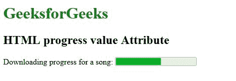

# HTML | progress 值属性

> 原文:[https://www . geesforgeks . org/html-progress-value-attribute/](https://www.geeksforgeeks.org/html-progress-value-attribute/)

**<进度>值属性**用于使用进度条指定已完成的任务。

**语法:**

```html
<progress value="number">
```

**属性值:**包含单值**号**，为浮点数，用于指定已完成的任务。

**注意:**这个属性在 HTML 5 中是新的。

**示例:**

```html
<!DOCTYPE html>
<html>

<head>
    <title>
        HTML progress value Attribute
    </title>
</head>

<body>
    <h1 style="color:green;"> 
        GeeksforGeeks 
    </h1>

    <h2> 
        HTML progress value Attribute 
    </h2> Downloading progress for a song:
    <progress value="57"
              max="100">
  </progress>
</body>

</html>
```

**输出:**


**支持的浏览器:**支持的浏览器 **HTML <进度>值属性**如下:

*   谷歌 Chrome 8.0
*   Internet Explorer 10.0
*   Firefox 16.0
*   Safari 6.0
*   Opera 11.0