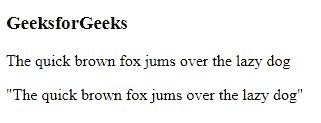
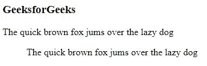
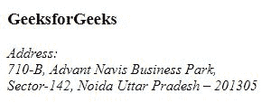
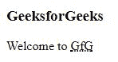
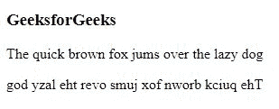
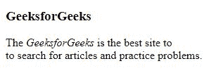

# HTML |语录

> 原文:[https://www.geeksforgeeks.org/html-quotations/](https://www.geeksforgeeks.org/html-quotations/)

HTML 中的报价元素用于在网页中插入报价文本，即不同于网页中正常文本的文本部分。
以下是 HTML 中一些最常用的引用元素:

1.  **< q >元素:**
    <q>元素用于在引号内设置一组文本。它有开始和结束标签。
    **示例** :

## 超文本标记语言

```html
<!DOCTYPE html>
<html>
<head>
    <title>Quotations</title>
</head>
<body>
    <h3>GeeksforGeeks</h3>

<p>The quick brown fox jumps over the lazy dog<br></p>

    <!--Inside quotes-->

<p><q>The quick brown fox jumps over the lazy dog</q></p>

</body>
</html>
```

1.  **输出** :



1.  **< blockquote >元素:**
    <block quote>元素也以不同的方式用于报价。它不是将文本放在引号中，而是改变对齐方式，使其与众不同。它有开始和结束标签。
    **示例** :

## 超文本标记语言

```html
<!DOCTYPE html>
<html>
<head>
    <title>Blockquote</title>
</head>
<body>
    <h3>GeeksforGeeks</h3>

<p>The quick brown fox jumps over the lazy dog<br></p>

    <!--Inside blockquotes-->

<p><blockquote>The quick brown fox jumps
over the lazy dog</blockquote></p>

</body>
</html>
```

1.  **输出** :



1.  **<地址>元素:**
    使用<地址>元素，我们可以在网页中定义一个地址，放在地址标签内的文本将被强调。它有开始和结束标签。
    **示例** :

## 超文本标记语言

```html
<!DOCTYPE html>
<html>
<head>
    <title>Address</title>
</head>
<body>
    <h3>GeeksforGeeks</h3>
    <address>

<p>Address:<br>
    710-B, Advant Navis Business Park,<br>
    Sector-142, Noida Uttar Pradesh – 201305</p>

    </address>
</body>
</html>
```

1.  **输出** :



1.  **<缩写>元素:**
    <缩写>元素用于将文本定义为首字母缩略词或缩写。当您将鼠标悬停在<缩写>元素上时，标题属性可用于显示缩写/首字母缩写的完整版本。它有开始和结束标签。这对浏览器和搜索引擎很有用。
    **示例** :

## 超文本标记语言

```html
<!DOCTYPE html>
<html>
<head>
    <title>Abbreviations</title>
</head>
<body>
    <h3>GeeksforGeeks</h3>
    <!--Here the marked text is the acronym-->

<p>Welcome to <abbr title="GeeksforGeeks">GfG</abbr></p>

</body>
</html>
```

1.  **输出** :



1.  **< bdo >元素:**
    <bdo>元素用于定义双向覆盖，即文本从右向左或从左向右书写。它有开始和结束标签。它用于覆盖当前文本方向。从右向左显示文本需要属性“rtl”。
    **示例** :

## 超文本标记语言

```html
<!DOCTYPE html>
<html>
<head>
    <title>Bidirectional</title>
</head>
<body>
    <h3>GeeksforGeeks</h3>
    <!--Normal text-->   

<p>The quick brown fox jumps over the lazy dog<br></p>

    <!--Inside <bdo> tag-->

<p><bdo dir="rtl">The quick brown fox jumps
over the lazy dog</bdo></p>

</body>
</html>
```

1.  **输出** :



1.  **<引用>元素:**
    这个元素用来定义作品的标题，强调一个文本。
    **示例** :

## 超文本标记语言

```html
<!DOCTYPE html>
<html>
<head>
    <title>Cite</title>
</head>
<body>
    <h3>GeeksforGeeks</h3>
    <!--The title is kept in cite tag-->

<p>The <cite>GeeksforGeeks</cite> is the best site to<br>
    to search for articles and practice problems.</p>

</body>
</html>
```

1.  **输出** :



**支持的浏览器:**

*   谷歌 Chrome
*   微软边缘
*   火狐浏览器
*   歌剧
*   旅行队