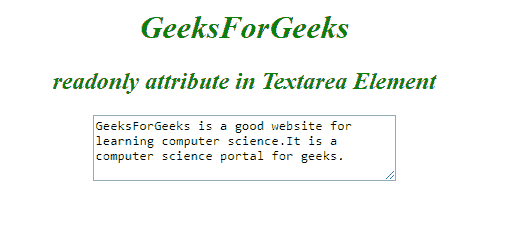

# HTML |只读属性

> 原文:[https://www.geeksforgeeks.org/html-readonly-attribute/](https://www.geeksforgeeks.org/html-readonly-attribute/)

它是一个布尔属性，用于指定输入或文本区域元素中写入的文本是只读的。这意味着用户不能修改或更改特定元素中已经存在的内容(但是，用户可以定位到它，突出显示它，并从中复制文本)。而 JavaScript 可以用来更改只读值并使输入字段可编辑。

**元素:**该属性与下面列出的两个元素一起使用:

*   **<输入> :** 用于只读属性只读内容。
*   **<文本区>** 用于保存只读属性。

**例:1**

*   **语法:**

    ```html
    <input readonly>
    ```

    *   **程序:**

    ```html
    <!DOCTYPE html>
    <html>

    <head>
        <title>readonly attribute</title>
        <style>
            body {
                text-align: center
            }

            h1,
            h2 {
                color: green;
                font-style: italic;
            }
        </style>
    </head>

    <body>
        <h1>GeeksForGeeks</h1>
        <h2>readonly attribute in Input Element</h2>
        <form action="">
            Email:
            <input type="text" name="email">
            <br> Country:
            <input type="text" name="country" 
                             value="Noida" readonly>
            <br>
            <input type="submit" value="Submit">
        </form>
    </body>

    </html>
    ```

    *   **Output:**
    

    **例:2**

    *   **语法:**

    ```html
    <textarea readonly>
    ```

    *   **例:**

    ```html
    <!DOCTYPE html>
    <html>

    <head>
        <title>readonly attribute</title>
        <style>
            body {
                text-align: center;
            }

            h1,
            h2 {
                color: green;
                font-style: italic;
            }
        </style>
    </head>

    <body>
        <h1>GeeksForGeeks</h1>
        <h2>readonly attribute in input Element</h2>
        <textarea rows="4" cols="40" readonly>
          GeeksForGeeks is a good website for 
          learning computer science. It is a 
          computer science portal for geeks.
        </textarea>
    </body>

    </html>
    ```

    *   **Output:**
    

    **支持的浏览器:**只读属性支持的浏览器如下:

    *   谷歌 Chrome
    *   微软公司出品的 web 浏览器
    *   火狐浏览器
    *   歌剧
    *   旅行队