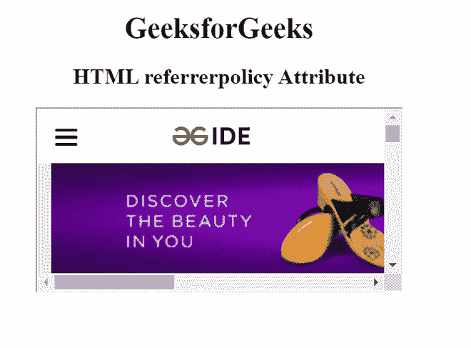
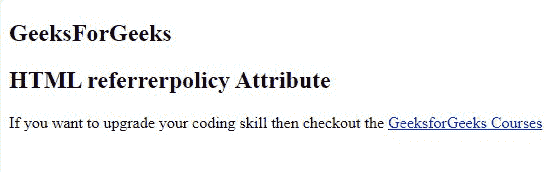

# HTML 引用者策略属性

> 原文:[https://www . geesforgeks . org/html-referer policy-attribute/](https://www.geeksforgeeks.org/html-referrerpolicy-attribute/)

**HTML referer policy 属性**用于定义一个 HTTP 头控件，该控件指定从服务器中取出结果时将发送到服务器的引用信息量。主要用于以下元素:< a >、<区域>、<链接>、< img >、< iframe >、<脚本>元素。Referrer 策略用于在获取资源或执行导航时维护源帐户的安全性和隐私性。这是通过修改用于填充推荐人*头*的算法来完成的。请参考 [HTTP 头|推荐人-策略](https://www.geeksforgeeks.org/http-headers-referrer-policy/)文章了解更多详细信息。

**支持的标签:**

*   [**<a>**](https://www.geeksforgeeks.org/html-a-referrerpolicy-attribute/)**:**用于指定用户点击超链接时发送给服务器的参考信息。
*   [**<区域>**](https://www.geeksforgeeks.org/html-area-referrerpolicy-attribute/) **:用于指定客户端的引用信息，在取出结果时会发送到服务器端。**
*   [**<脚本>**](https://www.geeksforgeeks.org/html-script-referrerpolicy-attribute/) **:用于指定取脚本时会发送到服务器的引用信息。**
*   [**< img >**](https://www.geeksforgeeks.org/html-img-referrerpolicy-attribute/) **:用于指定取图时会发送给服务器的参考信息。**
*   [**<iframe>**](https://www.geeksforgeeks.org/html-iframe-referrerpolicy-attribute/)**:用于指定取结果时发送的参考信息。**
*   [**<链接>**](https://www.geeksforgeeks.org/?p=619267) **:** 用于指定资源取出时会发送到服务器的引用信息。

**语法:**

```html
<element referrerpolicy="value">
```

**值:**

*   **无引用者:**指定不会随请求发送引用信息。
*   **降级时无推荐人**:有默认值。它指定引用头将不会发送到没有 HTTPS 的源。
*   **来源:**指定在所有情况下只发送文档的来源作为推荐人。
*   **原点-当-跨原点:**执行同原点请求时发送原点、路径、查询字符串，其他情况只发送单据的原点。
*   **同源:**指定将为同站点源发送推荐人，但跨源请求将不发送推荐人信息。
*   **严格-起源:**它只在协议安全级别不变(HTTPS/HTTPS)的情况下发送文档的起源作为引荐者，但不发送到不太安全的目的地(HTTPS/HTTP)。
*   **严格-起源-当-跨起源:**它在执行同起源请求时发送起源、路径和查询字符串，在执行跨起源请求时仅在协议安全级别保持不变时发送起源(HTTPS/HTTPS)，并且不向任何不太安全的目的地发送报头(HTTPS/HTTP)。
*   **unsafe-url:** 它发送一个源、路径和查询字符串作为一条参考信息，但不包括密码和用户名。

**示例代码:**下面的代码说明了< iframe >元素中 referrerpolicy 属性的使用。

## 超文本标记语言

```html
<!DOCTYPE html>
<html>
  <head>
    <title>HTML referrerpolicy Attribute</title>
  </head>

  <body style="text-align: center">
    <h1>GeeksforGeeks</h1>

    <h2>HTML referrerpolicy Attribute</h2>

    <iframe
      src="https://ide.geeksforgeeks.org/index.php"
      height="200"
      width="400"
      referrerpolicy="no-referrer">
    </iframe>
  </body>
</html>
```

**输出:**在这种情况下，referrerpolicy 属性的值设置为“无引用者”，这意味着无引用者信息将与 HTTP 请求一起发送到服务器。



**示例 2:** 下面的代码说明了<标签中 referrerpolicy 属性的使用。

## 超文本标记语言

```html
<!DOCTYPE html>
<html>
  <head>
    <title>HTML referrerpolicy Attribute</title>
  </head>

  <body>
    <h2>GeeksForGeeks</h2>
    <h2>HTML referrerpolicy Attribute</h2>

<p>
      If you want to upgrade your coding skill then checkout the
      <a
        rel="noopener"
        href="https://practice.geeksforgeeks.org/courses/"
        referrerpolicy="unsafe-url">
        GeeksforGeeks Courses
      </a>
    </p>

  </body>
</html>
```

**输出:**在这种情况下，我们在 anchor 元素中使用了 referrerpolicy 属性，该值设置为“unsafe-url”，发送一个源路径，查询字符串作为一条参考信息，但不包括密码和用户名。



**支持的浏览器:****HTML referer policy 属性**支持的浏览器列表如下 **:**

*   谷歌 Chrome 51.0
*   Internet Explorer 79.0
*   Firefox50.0
*   Safari 11.1
*   Opera 38.0