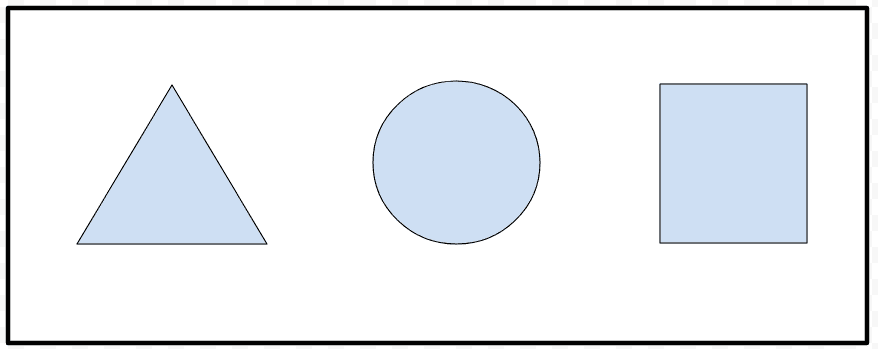

# HTML | rel 属性

> 原文:[https://www.geeksforgeeks.org/html-rel-attribute/](https://www.geeksforgeeks.org/html-rel-attribute/)

**rel 属性**用于指定当前文档和链接文档之间的关系。它仅在 href 属性存在时使用。
**支持的标签:**
rel 属性应用于以下元素:

*   [a:继电器](https://www.geeksforgeeks.org/html-a-rel-attribute/)
*   [区域:rel](https://www.geeksforgeeks.org/html-area-rel-attribute/)
*   链接： 关系
*   形状:继电器

**超文本标记语言相关属性示例**

## 超文本标记语言

```html
<!DOCTYPE html>
<html>

<head>
    <title>HTML a rel Attribute</title>
</head>

<body>

<p>Welcome to
        <a rel="noopener"
        href="https://ide.geeksforgeeks.org/">
                GeeksforGeeks
            </a>
    </p>

</body>

</html>
```

**输出:**


**HTML 区域相关属性示例**

## 超文本标记语言

```html
<!DOCTYPE html>
<html>

<head>
    <title>
        HTML area rel Attribute
    </title>
</head>

<body style="text-align:center;">
    

    <map name="shapemap">

        <!-- area tag contained image. -->
        <area shape="poly" coords="59, 31, 28, 83, 91, 83"
href="https://media.geeksforgeeks.org/wp-content/uploads/20190227165802/area2.png"
            alt="Triangle" rel="alternate">

        <area shape="circle" coords="155, 56, 26"
href="https://media.geeksforgeeks.org/wp-content/uploads/20190227165934/area3.png"
            alt="Circle" rel="alternate">

        <area shape="rect" coords="224, 30, 276, 82"
href="https://media.geeksforgeeks.org/wp-content/uploads/20190227170021/area4.png"
            alt="Square" rel="alternate">
    </map>
</body>

</html>                    
```

**输出:**

**点击具体可点击区域前:**



**点击具体可点击区域后:**


**支持的浏览器:****HTML rel 属性**支持的浏览器如下

*   谷歌 Chrome 4.0
*   Firefox 4.0
*   苹果 Safari 4.0
*   歌剧 10.5
*   互联网浏览器/边缘