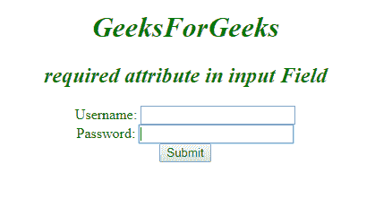
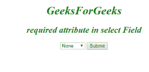
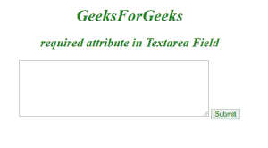

# HTML |必填属性

> 原文:[https://www.geeksforgeeks.org/html-required-attribute/](https://www.geeksforgeeks.org/html-required-attribute/)

它是一个布尔属性，用于指定在提交表单之前必须填写输入元素。
**元素:**这个属性可以和下面列出的三个元素相关联:

*   [**<输入>**](https://www.geeksforgeeks.org/html-input-required-attribute/?ref=rp)
*   [**<选择>**](https://www.geeksforgeeks.org/html-select-required-attribute/?ref=rp)
*   [**<>**](https://www.geeksforgeeks.org/html-textarea-required-attribute/?ref=rp)

*   **语法:**

```html
<input required>
```

*   **示例-1:**

## 超文本标记语言

```html
<!DOCTYPE html>
<html>
    <head>
        <title>required Attribute</title>
        <style>
            h1, h2 {
                color:green;
                font-style:italic;
            }
            body {
                text-align:center;
            }
        </style>
    </head>
    <body>
        <h1>GeeksForGeeks</h1>
        <h2>required attribute in input Field</h2>
        <form action="">
            Username:
            <input type="text" name="username" required>
            <br>
            Password:
            <input type="password"name="password">
            <br>
            <input type="submit">
        </form>
    </body>
</html>                   
```

*   **输出:**



*   **语法:**

```html
<select required>
```

*   **示例-2:**

## 超文本标记语言

```html
<!DOCTYPE html>
<html>
    <head>
        <title>required Attribute</title>
        <style>
            h1, h2 {
                color:green;
                font-style:italic;
            }
            body {
                text-align:center;
            }
        </style>
    </head>
    <body>
        <h1>GeeksForGeeks</h1>
        <h2>required attribute in select Field</h2>
        <form action="">
            <select required>
                <option value="">None</option>
                <option value="ds">Data Structure</option>
                <option value="algo">Algorithm</option>
                <option value="os">Operating System</option>
                <option value="cn">Computer Network</option>
            </select>
            <input type="submit">
        </form>
    </body>
</html>                   
```

*   **输出:**



*   **语法:**

```html
<textarea required>
```

*   **示例-3:**

## 超文本标记语言

```html
<!DOCTYPE html>
<html>
    <head>
        <title>required Attribute</title>
        <style>
            h1, h2 {
                color:green;
                font-style:italic;
            }
            body {
                text-align:center;
            }
        </style>
    </head>
    <body>
        <h1>GeeksForGeeks</h1>
        <h2>required attribute in Textarea Field</h2>
        <form action="">
            <textarea rows="7" cols="50"
                             name="comment" required>
            </textarea>
            <input type="submit">
        </form>
    </body>
</html>                   
```

*   **输出:**



**支持的浏览器:**所需属性支持的浏览器如下:

*   谷歌 Chrome 5.0+
*   Internet Explorer 11.0+
*   Firefox 4+
*   Opera 9.7+