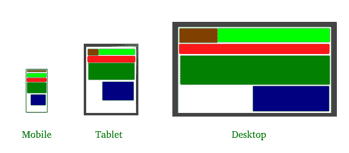
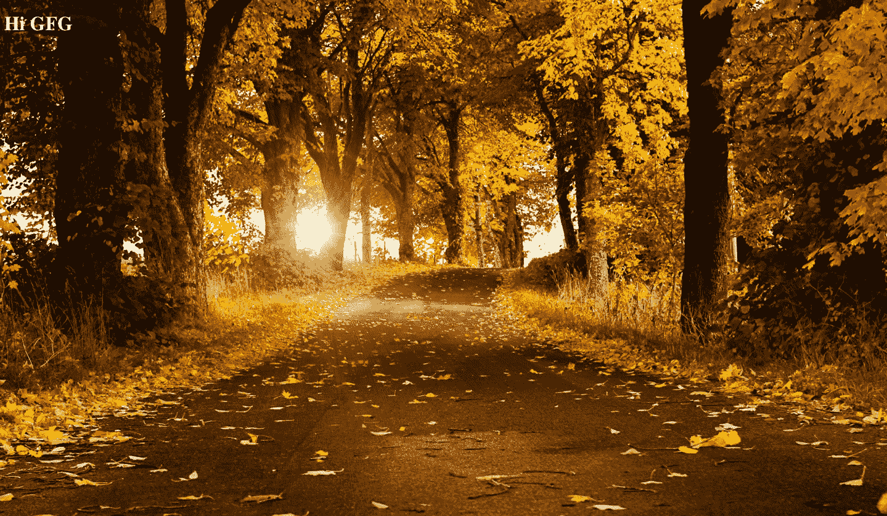
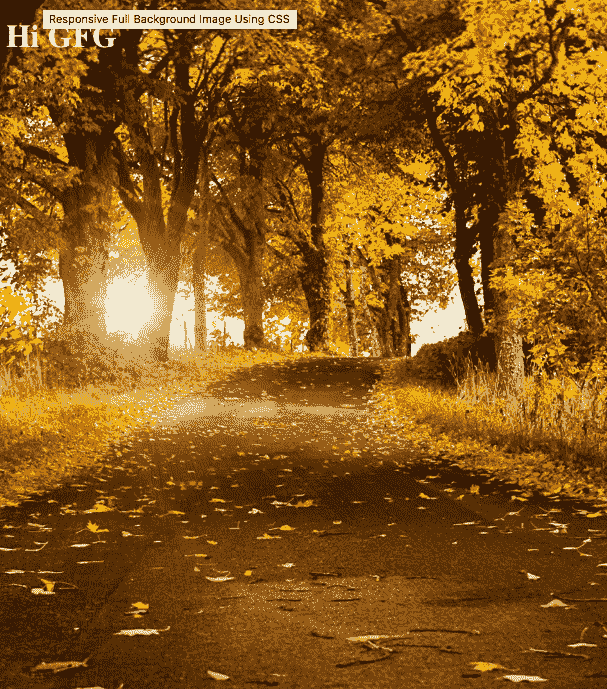
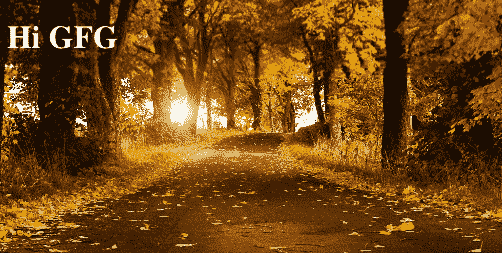

# HTML |使用 CSS 的响应性全页图像

> 原文:[https://www . geesforgeks . org/html-responsive-full-page-image-use-CSS/](https://www.geeksforgeeks.org/html-responsive-full-page-image-using-css/)

**响应式网页设计(RWD)** ，一种为应对移动设备惊人的网络浏览普及而开发的设计策略。响应式图像是响应式网页设计的重要组成部分(RWD)，
响应式网页设计是一种新的网站设计方法，可确保用户无论使用何种设备都有良好的观看体验。
网络设计师伊森·马科特被认为创造了“响应性设计”这个术语 2010 年，他在《除了名单》上发表了一篇文章，讨论了设备、浏览器、屏幕大小和方向等快速变化的环境。为每种类型的设备建立单独的站点是不可持续的。相反，他提出了一个替代概念:响应设计，这要求构建灵活多变的布局，以适应几乎任何屏幕。

开发人员使用了几个框架来使网页具有响应性。

*   引导程序
*   基础
*   纯的
*   骨骼
*   美国著名软件公司

**响应的整页背景图像**会根据用户的视口进行缩放。有几个网站使用这种效果，比如-

*   [sailingcollective.com](https://sailingcollective.com/)
*   [sailingcollective.com](https://basis-ag.com/en/basis-home/)
*   [柏林地产](https://basis-ag.com/en/basis-home/)

这种全页面背景图像效果可以很容易地添加到网页使用 CSS。
**示例实现**
输入
**HTML**

```html
<!DOCTYPE html>
<head>
    <link rel="stylesheet" href="css/main.css">
    <title>Responsive Background Example</title>
</head>
<body>
    <h1>Hi GFG</h1>
</body>
</html> 
```

CSS

```html
body {
    /* Image Location */
    background-image: url("../img/Fall-Nature-Background-Pictures.jpg");

    /* Background image is centered vertically and horizontally at all times */
    background-position: center center;
    background-repeat: no-repeat;
    background-attachment: fixed;
    background-size: cover;
    background-color: #464646;
    /* Font Colour */
    color:white;
}
```

**解说**
***背景-大小:封面；***
该属性告诉浏览器按比例缩放背景图像，使其宽度和高度等于或大于元素的宽度/高度。
***背景-位置:居中居中；***
以上设置了视口中心的缩放轴。
***背景-附件:固定；***
背景相对于视口是固定的
**输出**
输出显示不同视口的背景图像。


