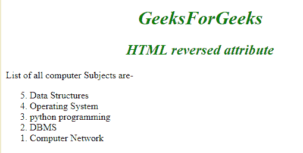

# HTML |反转属性

> 原文:[https://www.geeksforgeeks.org/html-reversed-attribute/](https://www.geeksforgeeks.org/html-reversed-attribute/)

它是一个布尔属性，用于按降序排列列表(9，8，7，6 …..)而不是升序(1，2，3 …).

**语法:**

```html
<ol reversed>
    <li> Content... </li>
    <li> Content... </li>
    ...
    <li> Content... </li>
</ol>
```

**适用:**

[**<ol>**T3】](https://www.geeksforgeeks.org/html-ol-reversed-attribute/?ref=rp)

**属性:**包含单属性*反转*。它是一个布尔属性，以降序指定列表。

**示例:**

## 超文本标记语言

```html
<!DOCTYPE html>
<html>
    <head>
        <title>reversed attribute</title>
        <style>
            h1, h2 {
                text-align:center;
            }
        </style>
    </head>
    <body>
        <h1 style ="color:green;font-style:italic;">
            GeeksforGeeks
        </h1>
        <h2 style="color:green;font-style:italic;">
            HTML reversed attribute
        </h2>

<p>List of all computer Subjects are</p>

        <ol reversed>
            <li>Data Structures</li>
            <li>Operating System</li>
            <li>python programming</li>
            <li>DBMS</LI>
            <li>Computer Network</li>
        </ol>
    </body>
</html>                               
```

**输出:**



**支持的浏览器:**HTML 支持的浏览器*反转*属性如下:

*   谷歌 Chrome 18.0
*   Firefox 18.0
*   歌剧
*   Safari 5.2