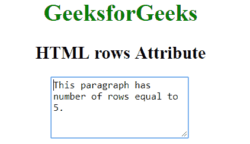

# HTML |行属性

> 原文:[https://www.geeksforgeeks.org/html-rows-attribute/](https://www.geeksforgeeks.org/html-rows-attribute/)

HTML 中的 rows 属性用于指定控件的可见文本行数，即要显示的行数。
**注意:**此属性仅适用于 [<文本区>。](https://www.geeksforgeeks.org/html-textarea-rows-attribute/?ref=rp)
**语法:**

```html
<textarea rows = "value">Text content...</textarea>
```

**属性值:**默认值为 2。它包含一个指定 textarea 元素高度的数值。

**示例:**

## 超文本标记语言

```html
<!DOCTYPE html>
<html>

<head>
    <title>HTML rows Attribute</title>
    <style>
        h1,
        h2 {
            text-align: center;
        }
    </style>
</head>

<body>
    <center>
        <h1 style="color: green;">
            GeeksforGeeks
        </h1>

        <h2>
            HTML rows Attribute
        </h2>

        <!-- Below Textarea element has rows
            attribute assigned to 5 -->
        <textarea rows="5" cols="23">
            This paragraph has a number of rows equal to 5.
        </textarea>
    </center>
</body>

</html> 
```

**输出:**



**支持的浏览器:**支持的浏览器*行*属性如下:

*   谷歌 Chrome
*   微软公司出品的 web 浏览器
*   火狐浏览器
*   歌剧
*   旅行队