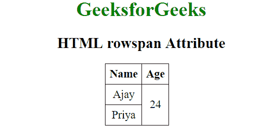
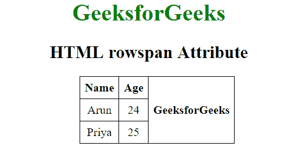

# HTML | rowspan 属性

> 原文:[https://www.geeksforgeeks.org/html-rowspan-attribute/](https://www.geeksforgeeks.org/html-rowspan-attribute/)

HTML 中的 rowspan 属性指定单元格应该跨越的行数。也就是说，如果一行跨越两行，这意味着它将占用该表中两行的空间。它允许单个表格单元格跨越多个单元格或行的高度。它提供了与 Excel 等电子表格程序中的“合并单元格”相同的功能。
**用法:**可与 [HTML 表格](https://www.geeksforgeeks.org/html-tables/)中的[<【TD】>](https://www.geeksforgeeks.org/html-td-rowspan-attribute/?ref=rp)和 [< th >](https://www.geeksforgeeks.org/html-th-rowspan-attribute/?ref=rp) 元素配合使用。

**属性值:**它包含一个值，即**数**，该值指定表格单元格应跨越的行数。

*   **<【TD】>:**row span 属性与< td >标签一起使用时，决定了它应该跨越的标准单元格的数量。
    **语法:**

```html
<td rowspan = "value">table content...</td>
```

**值**指定单元格填充的行数。该值必须是整数。
T3】例:

## 超文本标记语言

```html
<!DOCTYPE html>
<html>
    <head>
        <title>HTML rowspan Attribute</title>
        <style>
            table, th, td {
                border: 1px solid black;
                border-collapse: collapse;
                padding: 6px;
            }
        </style>
    </head>

    <body style = "text-align:center">

        <h1 style = "color: green;">GeeksforGeeks</h1>
        <h2>HTML rowspan Attribute</h2>

        <table>
            <tr>
                <th>Name</th>
                <th>Age</th>
            </tr>
            <tr>
                <td>Ajay</td>
                <!-- This cell will take up space on
                    two rows -->
                <td rowspan="2">24</td>
            </tr>
            <tr>
                <td>Priya</td>
            </tr>
        </table>

    </body>
</html>                   
```

**输出:**



*   **<th>:**row span 属性与< th >标记一起使用时，决定了它应该跨越的标题单元格的数量。
    **语法:**

```html
<th rowspan = "value">table content...</th>
```

**值**指定单元格填充的行数。该值必须是整数。
T3】例:

## 超文本标记语言

```html
<!DOCTYPE html>
<html>
    <head>
        <title>HTML rowspan Attribute</title>
        <style>
            table, th, td {
                border: 1px solid black;
                border-collapse: collapse;
                padding: 6px;
            }
        </style>
    </head>

    <body style = "text-align:center">
        <h1 style = "color: green;">GeeksforGeeks</h1>
        <h2>HTML rowspan Attribute</h2>

        <table>
            <tr>
                <th>Name</th>
                <th>Age</th>
                <!-- This cell will take up space
                    in 3 rows -->
                <th rowspan="3">GeeksforGeeks</th>
            </tr>
            <tr>
                <td>Arun</td>
                <td>24</td>
            </tr>
            <tr>
                <td>Priya</td>
                <td>25</td>
            </tr>
        </table>
    </body>
</html>                   
```

**输出:**



**支持的浏览器:**row span 属性支持的浏览器如下:

*   谷歌 Chrome
*   微软公司出品的 web 浏览器
*   火狐浏览器
*   歌剧
*   旅行队