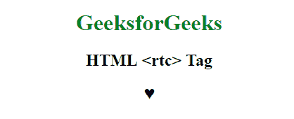
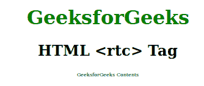

# HTML | rtc 标签

> 原文:[https://www.geeksforgeeks.org/html-rtc-tag/](https://www.geeksforgeeks.org/html-rtc-tag/)

**HTML < rtc >标签**用于定义红宝石注释的解释，红宝石注释是一个小文本，附带主文本。这种注释在日文或中文出版物中使用。 **< rtc >标签**包含 [< rt >标签](https://www.geeksforgeeks.org/html5-rt-tag/)，这个标签在 HTML 5 中是新的。

**语法:**

```html
<rtc> statement </rtc>
```

**例 1:**

```html
<!DOCTYPE html>
<html>

<head>
    <title>HTML <rtc> tag</title>
    <style>
        body {
            text-align: center;
        }

        h1 {
            color: green;
        }

        ruby {
            font-size: 25px;
        }
    </style>
</head>

<body>
    <h1>GeeksforGeeks</h1>
    <h2>HTML <rtc> Tag</h2>
    <ruby>
        <rtc>
            <rt>♥</rt>
        </rtc>
    </ruby>
</body>

</html>
```

**输出:**


**例 2:** 本例不包含<红宝石>标签。

```html
<!DOCTYPE html>
<html>

<head>
    <title>HTML <rtc> tag</title>
    <style>
        body {
            text-align: center;
        }

        h1 {
            color: green;
        }
    </style>
</head>

<body>
    <h1>GeeksforGeeks</h1>
    <h2>HTML <rtc> Tag</h2>
    <rtc>
        <rt>GeeksforGeeks Contents</rt>
    </rtc>
</body>

</html>
```

**输出:**


**支持的浏览器:**<RTC>标签支持的浏览器如下:

*   谷歌 Chrome 5.0
*   Internet Explorer 5.5
*   Firefox 38.0
*   Opera 15.0
*   Safari 5.0