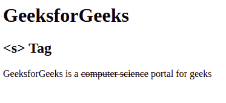

# HTML s 标签

> 原文:[https://www.geeksforgeeks.org/html-s-tag/](https://www.geeksforgeeks.org/html-s-tag/)

此标签用于指定文本内容不再正确或准确。该标签与 [< del >标签](https://www.geeksforgeeks.org/html-del-tag/)相似，但略有不同。它不用于替换或删除文本，但< del >标签用于替换或删除文本。
**语法:**

```html
<s> Contents... </s>
```

**注意:**这个标签是从 HTML 4.1 折下来的，但是在 HTML 5 中重新定义了。它用来定义文本不再正确。
**例:**

## 超文本标记语言

```html
<!DOCTYPE html>
<html>

        <body>

            <h1>GeeksforGeeks</h1>
            <h2><s> Tag</h2>

<p>GeeksforGeeks is a
                <!-- html <s> tag is used here -->
                <s>computer science</s>
                portal for geeks</p>

        </body>

</html>
```

**输出:**



**支持的浏览器:**

*   谷歌 Chrome
*   微软公司出品的 web 浏览器
*   火狐浏览器
*   歌剧
*   旅行队