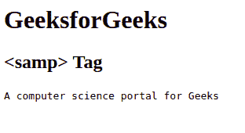

# HTML samp 标签

> 原文:[https://www.geeksforgeeks.org/html-samp-tag/](https://www.geeksforgeeks.org/html-samp-tag/)

它是一个短语标签，用于定义计算机程序的示例输出文本。
**语法:**

```html
<samp> Contents... </samp>
```

**例:**

## 超文本标记语言

```html
<!DOCTYPE html>
<html>

        <body>

            <h1>GeeksforGeeks</h1>
            <h2><samp> Tag</h2>
            <!-- html <samp> tag is used here -->
            <samp>A computer science portal for Geeks</samp>  

        </body>

</html>                   
```

**输出:**



**支持的浏览器:**

*   苹果 Safari
*   谷歌 Chrome
*   火狐浏览器
*   歌剧
*   微软公司出品的 web 浏览器