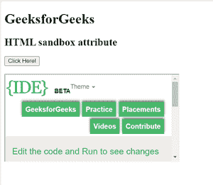

# HTML |沙盒属性

> 原文:[https://www.geeksforgeeks.org/html-sandbox-attribute/](https://www.geeksforgeeks.org/html-sandbox-attribute/)

**沙盒属性**允许对 iframe 中的内容进行一组额外的限制。当沙盒属性存在时，它将:
**将内容视为来自单一来源:**

*   它阻止表单提交
*   它会阻止脚本执行
*   它禁用了 API
*   它还防止链接瞄准其他浏览上下文
*   它停止内容以导航其顶级浏览上下文
*   阻止自动触发的功能(例如自动播放视频或自动聚焦表单控件)

沙盒属性的值要么是简单的沙盒(然后应用所有限制)，要么是一个用空格分隔的预定义值列表，它将带走实际的限制。
**支持的标签:**

*   <iframe></li></ul>
<strong>属性值</strong> s
<ul><li>无值:应用所有限制</li><li>允许表单:重新启用表单提交</li><li>允许指针锁定:重新启用应用编程接口</li><li>允许弹出窗口:重新启用弹出窗口</li><li>允许相同来源:它允许将 iframe 的内容视为来自相同的来源</li><li>允许脚本:重新启用脚本</li><li>允许顶级导航:允许 iframe 的内容导航其顶级浏览内容  <strong>示例:</strong>  </li></ul>
<h2 class="tabtitle">超文本标记语言</h2>
<pre>&lt;!DOCTYPE html&gt; &lt;html&gt;   &lt;head&gt;     &lt;title&gt;         HTML sandbox attribute     &lt;/title&gt; &lt;/head&gt;   &lt;body&gt;     &lt;h1&gt;GeeksforGeeks&lt;/h1&gt;       &lt;h2&gt;HTML sandbox attribute&lt;/h2&gt;       &lt;button onclick="myGeeks()"&gt;         Click Here!     &lt;/button&gt;       &lt;br&gt;     &lt;br&gt;       &lt;iframe id="GFGFrame"             src="https://ide.geeksforgeeks.org/tryit.php"             width="400"             height="200"             sandbox&gt;     &lt;/iframe&gt;       &lt;p id="GFG"&gt;&lt;/p&gt;           &lt;!-- script to access iframe element --&gt;     &lt;script&gt;         function myGeeks() {             var x = document.getElementById("GFGFrame").src;             document.getElementById("GFG").innerHTML = x;         }     &lt;/script&gt; &lt;/body&gt;   &lt;/html&gt;</pre>

<strong>输出:</strong>  

<strong>支持的浏览器:</strong><strong>HTML 沙盒属性</strong>支持的浏览器如下 
<ul><li>谷歌 Chrome 4.0</li><li>Firefox 17.0</li><li>苹果 Safari 5.0</li><li>Opera 15.0</li><li>Edge 10.0</li></ul>
 
 </body></html></iframe>