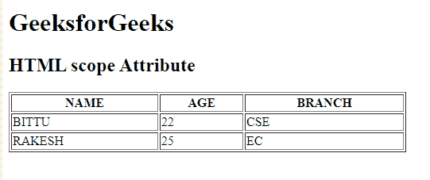

# HTML |范围属性

> 原文:[https://www.geeksforgeeks.org/html-scope-attribute-2/](https://www.geeksforgeeks.org/html-scope-attribute-2/)

**HTML 范围属性**用于指定用于标题行、标题列、标题列组或标题行组的标题单元格。此属性在浏览器上不显示任何视觉效果，但用于屏幕阅读器。

**用途:**可用于<第>元素。

**语法:**

```html
<th scope="col | row | colgroup | rowgroup"> 
```

**示例:**

```html
<!DOCTYPE html> 
<html> 

<head> 
    <title> 
        HTML  scope Attribute 
    </title> 
</head> 

<body> 
    <h1>GeeksforGeeks</h1> 

    <h2>HTML  scope Attribute</h2> 

    <table border="1" width="500"> 
        <tr> 
            <th scope="col">NAME</th> 
            <th scope="col">AGE</th> 
            <th scope="col">BRANCH</th> 
        </tr> 

        <tr> 
            <td>BITTU</td> 
            <td>22</td> 
            <td>CSE</td> 
        </tr> 

        <tr> 
            <td>RAKESH</td> 
            <td>25</td> 
            <td>EC</td> 
        </tr> 
    </table> 
</body> 

</html> 
```

**输出:**


**支持的浏览器:**HTML 范围属性支持的浏览器如下:

*   谷歌 Chrome
*   微软公司出品的 web 浏览器
*   火狐浏览器
*   旅行队
*   歌剧