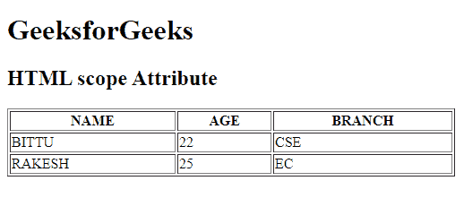

# HTML |范围属性

> 原文:[https://www.geeksforgeeks.org/html-scope-attribute/](https://www.geeksforgeeks.org/html-scope-attribute/)

**HTML 范围属性**用于指定标题单元格用于标题行、列、列组或行组。此属性在浏览器上不显示任何视觉效果，但用于屏幕阅读器。
**用法:**仅用于 [**<第>**](https://www.geeksforgeeks.org/html-th-scope-attribute/?ref=r) 元素。
**语法:**

```html
<th scope="col | row | colgroup | rowgroup">
```

**例:**

## 超文本标记语言

```html
<!DOCTYPE html>
<html>

<head>
    <title>
        HTML th scope Attribute
    </title>
</head>

<body>
    <h1>GeeksforGeeks</h1>

    <h2>HTML th scope Attribute</h2>

    <table border="1" width="500">
        <tr>
            <th scope="col">NAME</th>
            <th scope="col">AGE</th>
            <th scope="col">BRANCH</th>
        </tr>

        <tr>
            <td>BITTU</td>
            <td>22</td>
            <td>CSE</td>
        </tr>

        <tr>
            <td>RAKESH</td>
            <td>25</td>
            <td>EC</td>
        </tr>
    </table>
</body>

</html>
```

**输出:**



**支持的浏览器:****HTML 范围属性**支持的浏览器如下:

*   谷歌 Chrome
*   微软公司出品的 web 浏览器
*   火狐浏览器
*   苹果 Safari
*   歌剧