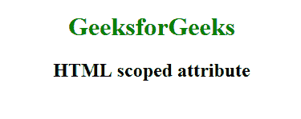

# HTML |范围属性

> 原文:[https://www.geeksforgeeks.org/html-scoped-attribute/](https://www.geeksforgeeks.org/html-scoped-attribute/)

HTML 范围的属性是一个布尔属性，用于指定样式只应用于这个元素的父元素和那个元素的子元素(而不是整个文档)。
**支持的标签:**

*   [风格](https://www.geeksforgeeks.org/html-style-tag/)

**例:**

## 超文本标记语言

```html
<!DOCTYPE html>
<html>

<head>
    <style>

    </style>
</head>

<body>
    <center>
        <div>
            <style scoped>
                h1 {
                    color: green;
                }

                h2 {
                    color: black;
                }
            </style>

            <h1 style="red">GeeksforGeeks</h1>
            <h2>HTML scoped attribute</h2>
        </div>
    </center>
</body>

</html>
```

**输出:**



**支持的浏览器:****HTML 范围属性**支持的浏览器如下:

*   火狐浏览器