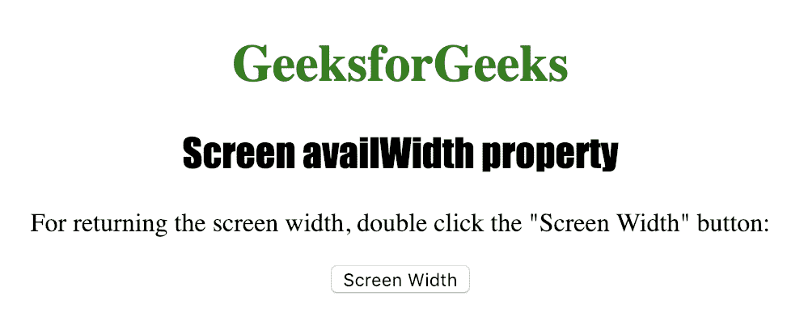
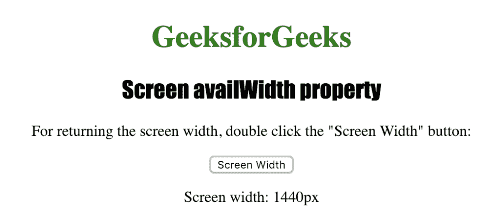

# HTML |屏幕可用宽度属性

> 原文:[https://www . geesforgeks . org/html-screen-avail width-property/](https://www.geeksforgeeks.org/html-screen-availwidth-property/)

**屏幕可用宽度**属性用于返回用户屏幕的宽度，以像素为单位。屏幕可用宽度属性返回的值不包括界面功能，如窗口任务栏。
**语法:**

```html
screen.availWidth
```

**返回值:**返回一个数值，代表用户屏幕的宽度，以像素为单位

下面的程序说明了屏幕宽度属性:
**获取用户屏幕的宽度。**
**输入:**

## 超文本标记语言

```html
<!DOCTYPE html>
<html>

<head>
    <title>
      Screen availWidth property in HTML
    </title>
    <style>
        h1 {
            color: green;
        }

        h2 {
            font-family: Impact;
        }

        body {
            text-align: center;
        }
    </style>
</head>

<body>

    <h1>GeeksforGeeks</h1>
    <h2>Screen availWidth property</h2>

<p>
      For returning the screen width,
      double click the "Screen Width" button:
    </p>

    <button ondblclick="screen_width()">
      Screen Width
    </button>

    <p id="width"></p>

    <script>
        function screen_width() {

            var w = "Screen width: " + screen.availWidth + "px";
            document.getElementById("width").innerHTML = w;

        }
    </script>

</body>

</html>
```

**输出:**



**点击**按钮后



**支持的浏览器:**支持的浏览器*屏幕可用宽度*如下:

*   谷歌 Chrome
*   微软公司出品的 web 浏览器
*   火狐浏览器
*   歌剧
*   旅行队