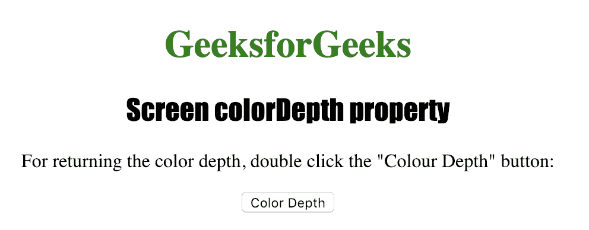
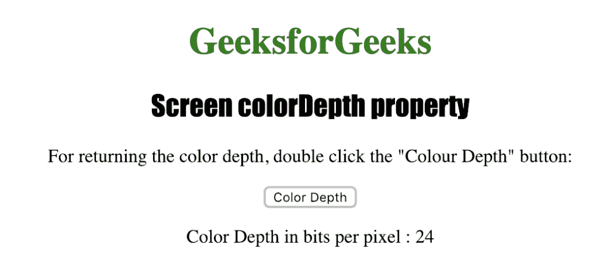

# HTML |屏幕颜色深度属性

> 原文:[https://www . geesforgeks . org/html-screen-color depth-property/](https://www.geeksforgeeks.org/html-screen-colordepth-property/)

**屏幕颜色深度**属性用于返回显示图像的调色板的位深度，单位为每像素位。
可能的值有:

*   每像素 1 位
*   每像素 4 位
*   每像素 8 位
*   每像素 15 位
*   每像素 16 位
*   每像素 24 位
*   每像素 32 位
*   每像素 48 位

**语法:**

```html
screen.colorDepth
```

**返回值:**一个数字，代表显示图像的调色板的位深度，单位为每像素位。

下面的程序说明了屏幕颜色深度属性:

**获取用户屏幕的宽度。**

## 超文本标记语言

```html
<!DOCTYPE html>
<html>

<head>
    <title>
      Screen colorDepth property in HTML
    </title>
    <style>
        h1 {
            color: green;
        }

        h2 {
            font-family: Impact;
        }

        body {
            text-align: center;
        }
    </style>
</head>

<body>

    <h1>GeeksforGeeks</h1>
    <h2>Screen colorDepth property</h2>

<p>
      or returning the color depth, double
      click the "Colour Depth" button:
    </p>

    <button ondblclick="color_depth()">
      Color Depth
    </button>

    <p id="depth"></p>

    <script>
        function color_depth() {

            var c =
                "Color Depth in bits per pixel : "
                            + screen.colorDepth;
            document.getElementById("depth").innerHTML = c;

        }
    </script>

</body>

</html>
```

**输出:**



**点击按钮**后



**支持的浏览器:**HTML |*屏幕颜色深度属性*支持的浏览器如下:

*   谷歌 Chrome
*   微软公司出品的 web 浏览器
*   火狐浏览器
*   歌剧
*   旅行队