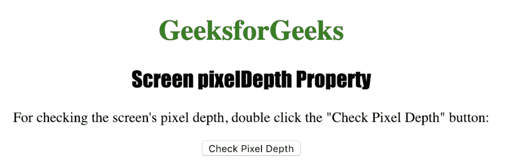
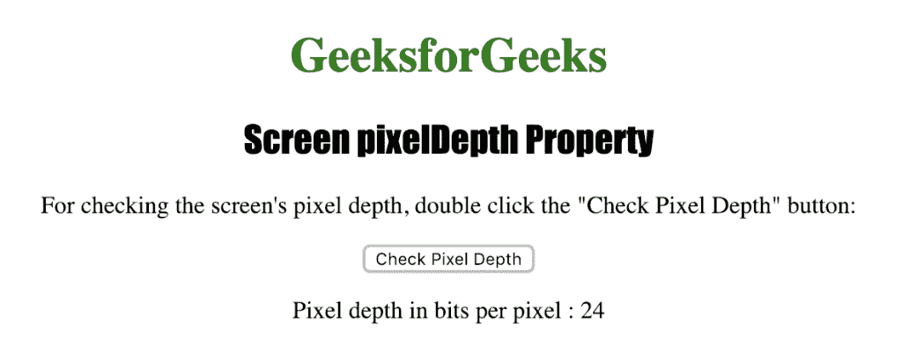

# HTML |屏幕像素属性

> 原文:[https://www . geesforgeks . org/html-screen-pixeldpth-property/](https://www.geeksforgeeks.org/html-screen-pixeldepth-property/)

**屏幕像素**属性用于返回访问者屏幕的颜色分辨率。它以每像素位为单位返回颜色分辨率。它是[颜色深度属性](https://www.geeksforgeeks.org/html-screen-colordepth-property/)的别名。

pixelDepth 属性返回的可能值有:

*   每像素 1 位
*   每像素 4 位
*   每像素 8 位
*   每像素 15 位
*   每像素 16 位
*   每像素 24 位
*   每像素 32 位
*   每像素 48 位

**语法:**

```html
screen.pixelDepth
```

**返回值:**代表颜色分辨率的数字，单位为每像素位数。

下面的程序说明了屏幕像素属性:

**检查用户屏幕的像素深度。**

## 超文本标记语言

```html
<!DOCTYPE html>
<html>

<head>
    <title>
      Screen pixelDepth Property in HTML
    </title>
    <style>
        h1 {
            color: green;
        }

        h2 {
            font-family: Impact;
        }

        body {
            text-align: center;
        }
    </style>
</head>

<body>

    <h1>GeeksforGeeks</h1>
    <h2>Screen pixelDepth Property</h2>

<p>
      For checking the screen's pixel depth,
      double click the "Check Pixel Depth" button:
    </p>

    <button ondblclick="pixel_depth()">
      Check Pixel Depth
    </button>

    <p id="pd"></p>

    <script>
        function pixel_depth() {
            var r = "Pixel depth in bits per pixel : "
                                + screen.pixelDepth;
            document.getElementById("pd").innerHTML = r;
        }
    </script>

</body>

</html>

```

**输出:**



**点击按钮**后



**支持的浏览器:**屏幕像素属性支持的浏览器列表如下:

*   谷歌 Chrome
*   微软公司出品的 web 浏览器
*   火狐浏览器
*   歌剧
*   旅行队