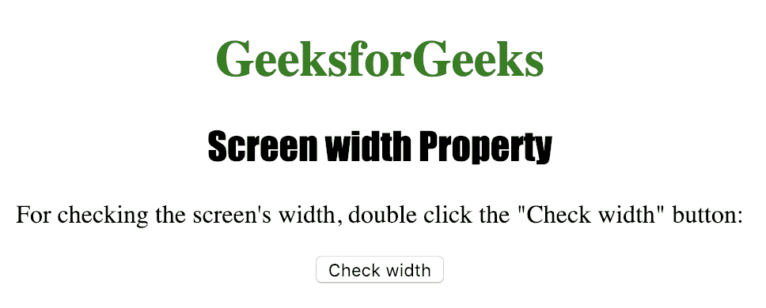
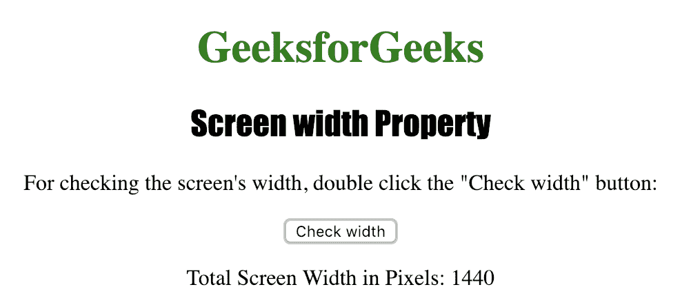

# HTML |屏幕宽度属性

> 原文:[https://www.geeksforgeeks.org/html-screen-width-property/](https://www.geeksforgeeks.org/html-screen-width-property/)

**屏幕宽度**属性用于返回用户屏幕的总宽度。它以像素为单位返回屏幕的总宽度。
**语法:**

```html
screen.width
```

**返回值:**代表用户屏幕总宽度的数字，以像素为单位

下面的程序说明了屏幕宽度属性:
**检查用户屏幕的总宽度。**T3】

## 超文本标记语言

```html

<!DOCTYPE html>
<html>

<head>
    <title>
        Screen width Property in HTML
    </title>
    <style>
        h1 {
            color: green;
        }

        h2 {
            font-family: Impact;
        }

        body {
            text-align: center;
        }
    </style>
</head>

<body>

    <h1>GeeksforGeeks</h1>
    <h2>Screen width Property</h2>

<p>
      For checking the screen's width,
      double click the "Check width" button:
    </p>

    <button ondblclick="width()">
        Check width
    </button>

    <p id="wd"></p>

    <script>
        function width() {
            var w = "Total Screen Width in Pixels: "
                                    + screen.width;
            document.getElementById("wd").innerHTML = w;
        }
    </script>

</body>

</html>
```

**输出:**



**点击**按钮后



**支持的浏览器:**屏幕宽度支持的浏览器如下:

*   谷歌 Chrome
*   微软公司出品的 web 浏览器
*   火狐浏览器
*   歌剧
*   旅行队