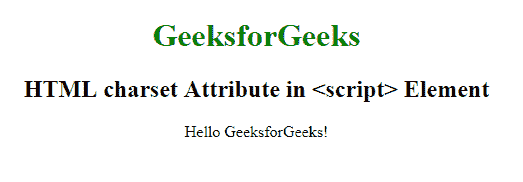

# HTML |脚本字符集属性

> 原文:[https://www . geesforgeks . org/html-script-charset-attribute/](https://www.geeksforgeeks.org/html-script-charset-attribute/)

**HTML <脚本>字符集属性**用于指定外部脚本中使用的字符编码。

**语法:**

```html
<script charset="charset">
```

**属性值:**包含值**字符集**，指定外部脚本的字符编码。

*   **“ISO-8859-1”:**用于指定拉丁字母的标准编码。
*   **“UTF-8”:**用于指定 Unicode 的字符编码。兼容 ASCII。

**示例:**本示例说明了**字符集属性**在脚本元素中的使用。

```html
<!DOCTYPE html>
<html>

<head>
    <title>
      script tag
  </title>
    <style>
        body {
            text-align: center;
        }

        h1 {
            color: green;
        }
    </style>
</head>

<body>
    <h1>
      GeeksforGeeks
  </h1>
    <h2>
      HTML charset Attribute in 
      <script> Element
  </h2>
    <p id="Geeks"></p>
    <script charset="UTF-8">
        document.getElementById("Geeks").innerHTML =
            "Hello GeeksforGeeks!";
    </script>
</body>

</html>
```

**输出:**


**支持的浏览器:**以下是 **HTML <脚本>字符集属性**支持的浏览器:

*   谷歌 Chrome
*   微软公司出品的 web 浏览器
*   火狐浏览器
*   歌剧
*   旅行队