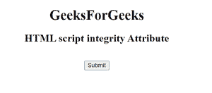
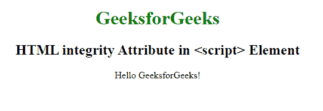

# HTML 脚本完整性属性

> 原文:[https://www . geesforgeks . org/html-script-integrity-attribute/](https://www.geeksforgeeks.org/html-script-integrity-attribute/)

**完整性**属性用于允许浏览器检查提取的脚本，以确保源代码永远不会被加载。它用于检查第三方是否已经更改了资源。

**子资源完整性(SRI)** 是 w3comsortium 开发的一项安全功能，用于向浏览器授予权限，以验证所有将被获取的外部脚本。它保证脚本不会被第三方修改。

**SRI 的工作流程将遵循以下步骤:**

*   网页保存哈希值，另一方面，服务器保存。js 文件。
*   现在，浏览器匹配完整性属性的哈希值
*   最后，如果哈希值匹配，则使用该文件，否则该文件将被阻止。

**语法**

```html
***<script integrity="filehash">***
```

**属性值:**

*   ***filehash:*** 表示外部脚本文件的哈希值。

**例 1:**

## 超文本标记语言

```html
<!DOCTYPE html>
<html>

<head>
    <title>
        HTML script integrity Attribute
    </title>
</head>

<body style="text-align:center;">
    <h1>
        GeeksForGeeks
    </h1>

    <h2>
        HTML script integrity Attribute
    </h2>

    <script id="myGeeks" type="text/javascript"
        src="my_script.js"
        integrity=
"sha384-q8i/X+965DzO0rT7abK41JStQIAqVgRVzpbzo5smXKp4YfRvH+8abtTE1Pi6jizo">
    </script>
    <br>

    <button>Submit</button>
</body>

</html>
```

**输出:**



**例 2:**

## 超文本标记语言

```html
<!DOCTYPE html>
<html>

<head>
    <title>
        script tag
    </title>

    <style>
        body {

            text-align: center;
        }

        h1 {
            color: green;
        }
    </style>
</head>

<body>
    <h1>GeeksforGeeks</h1>

    <h2>
        HTML integrity Attribute in <script> Element
    </h2>
    <p id="Geeks"></p>

    <script charset="UTF-8" integrity=
"e0d123e5f316bef78bfdf5a008837577OOo_2.0.1_LinuxIntel_install.tar.gz">

        document.getElementById("Geeks")
            .innerHTML = "Hello GeeksforGeeks!";
    </script>
</body>

</html>
```

**输出:**



**支持的浏览器:**

*   谷歌 Chrome 45.0
*   Internet Explorer 17.0
*   操作 66.0
*   Apple safari 13.0
*   Firefox 43.0