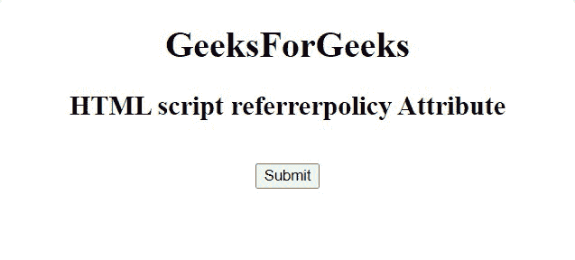

# HTML 脚本引用者策略属性

> 原文:[https://www . geesforgeks . org/html-script-referer policy-attribute/](https://www.geeksforgeeks.org/html-script-referrerpolicy-attribute/)

**HTML <脚本>引用者策略属性**用于指定获取脚本时将发送到服务器的引用信息。

**语法:**

```html
<script referrerpolicy="no-referrer|no-referrer-when-downgrade|
        origin|origin-when-cross-origin|same-origin|
        strict-origin-when-cross-origin|unsafe-url">

```

**属性值:**

*   **无引用者**:指定不会随请求一起发送引用信息。
*   **降级时无推荐人:**有默认值。它指定引用头将不会发送到没有 HTTPS 的源。
*   **原点**:指定在所有情况下发送文档的原点作为参考。
*   **原点-当-跨原点:**执行同原点请求时发送原点、路径、查询字符串，其他情况只发送单据的原点。
*   **同源:**指定将为同站点源发送推荐人，但跨源请求将不发送推荐人信息。
*   **严格-起源-当-跨起源:**它在执行同起源请求时发送起源、路径和查询字符串，在执行跨起源请求时仅在协议安全级别保持不变时发送起源(HTTPS/HTTPS)，并且不向任何不太安全的目的地发送报头(HTTPS/HTTP)。
*   **不安全-url:** 发送原点。路径和查询字符串，但不包括片段、密码和用户名。

**示例:**下面的代码说明了<脚本>元素中 referrerpolicy 属性的使用。

## 超文本标记语言

```html
<!DOCTYPE html>
<html>

<head>
    <title>HTML script referrerpolicy Attribute</title>
</head>

<body style="text-align: center">
    <h1>GeeksForGeeks</h1>

    <h2>HTML script referrerpolicy Attribute</h2>

    <br />
    <button>Submit</button>

    <script id="myGeeks" type="text/javascript" 
        src="my_script.js" referrerpolicy="no-referrer">
    </script>
</body>

</html>
```

**输出:**



**支持的浏览器:**

*   谷歌 Chrome
*   火狐浏览器
*   微软公司出品的 web 浏览器
*   歌剧
*   旅行队