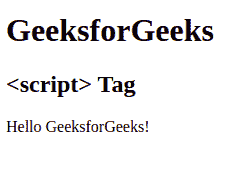
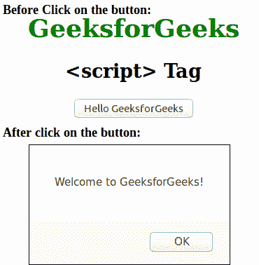

# HTML 脚本标签

> 原文:[https://www.geeksforgeeks.org/html-script-tag/](https://www.geeksforgeeks.org/html-script-tag/)

HTML 中的

```html
<script> Script Contents... </script>
```

**属性:**与脚本标签相关联的许多属性。

*   [**异步**](https://www.geeksforgeeks.org/html-script-async-attribute/) **:用于指定脚本异步执行。**
*   [](https://www.geeksforgeeks.org/html-script-charset-attribute/)****:**用于指定外部脚本文件中使用的字符编码。**
*   **[**delay**](https://www.geeksforgeeks.org/html-script-defer-attribute/)**:**用于指定页面解析完毕后执行脚本。**
*   **[**【src】**](https://www.geeksforgeeks.org/html-script-src-attribute/)**:用于指定外部脚本文件的 URL。****
*   **[**类型**](https://www.geeksforgeeks.org/html-script-type-attribute/) **:用于指定剧本的媒体类型。****

****例 1:**** 

## **超文本标记语言**

```html
<!DOCTYPE html>
<html>

        <body>

            <h1>GeeksforGeeks</h1>
            <h2><script> Tag</h2>
            <p id="Geeks"></p>

            <!-- html script tag starts here -->
            <script>
                document.getElementById("Geeks").innerHTML =
                                     "Hello GeeksforGeeks!";
            </script>   
            <!-- html script tag ends here -->

        </body>

</html>                   
```

****输出:**** 

****

****示例 2(正文标签外的脚本):****

## **超文本标记语言**

```html
<!DOCTYPE html>
<html>
    <head>
        <title>script tag</title>
        <style>
            body {
                text-align:center;
            }
            h1 {
                color:green;
            }
        </style>
        <script>
            function Geeks() {
                alert('Welcome to GeeksforGeeks!');
            }
        </script>
    </head>
    <body>
        <h1>GeeksforGeeks</h1>
        <h2><script> Tag</h2>
        <button type="button" onclick="Geeks()">
            Hello GeeksforGeeks</button>
    </body>
</html>                   
```

****输出:**** 

****

****支持的浏览器:**** 

*   **谷歌 Chrome**
*   **微软公司出品的 web 浏览器**
*   **火狐浏览器**
*   **歌剧**
*   **旅行队**