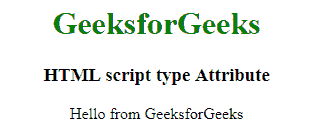

# HTML |脚本类型属性

> 原文:[https://www.geeksforgeeks.org/html-script-type-attribute/](https://www.geeksforgeeks.org/html-script-type-attribute/)

**HTML <脚本>类型属性**用于指定脚本的 MIME 类型，识别 Tag 的内容。它的默认值是“**文本/JavaScript”**。

**语法:**

```html
<script type="media_type">
```

**属性值:**它包含一个值，即 media_type，指定脚本的 MIME 类型。
**常见的“媒体 _ 类型”值有:**

*   文本/javascript(这是默认设置)
*   文本/ecmascript
*   应用程序/ecmascript
*   应用程序/javascript

**示例:**此示例说明了类型属性在<脚本>元素中的使用。

## 超文本标记语言

```html
<!DOCTYPE html>
<html>

<head>
    <title>
        HTML script type Attribute
    </title>
</head>

<body style="text-align:center; ">

    <h1 style="color:green;">
        GeeksforGeeks
    </h1>

    <h3>
        HTML script type Attribute
    </h3>

    <script id="myGeeks" type="text/javascript">
        document.write("Hello from GeeksforGeeks");
    </script>
</body>

</html>                                                      
```

**输出:**



**支持的浏览器:**HTML<脚本>类型属性支持的浏览器如下:

*   谷歌 Chrome
*   微软公司出品的 web 浏览器
*   Mozilla Firefox
*   旅行队
*   歌剧