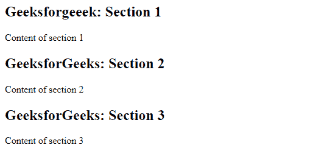
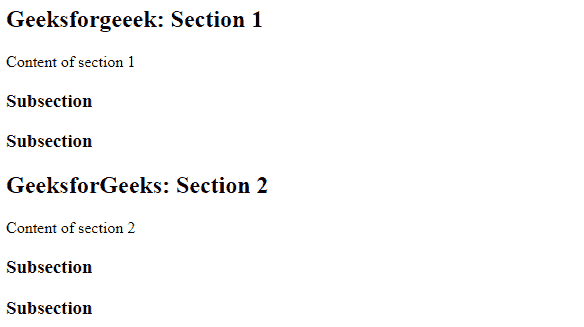

# HTML 节标签

> 原文:[https://www.geeksforgeeks.org/html-section-tag/](https://www.geeksforgeeks.org/html-section-tag/)

章节标签定义了文档的章节，如章节、页眉、页脚或任何其他章节。区段标签将内容分为区段和子区段。当需要两个页眉或页脚或文档的任何其他部分时，使用节标签。节标签将相关内容的通用块分组。区段标签的主要优点是，它是一个语义元素，向浏览器和开发人员描述了它的含义。
**语法:**

```html
<section> Section Contents </section>
```

区段标签用于分发内容，即它分发区段和子区段。
**例:**

## 超文本标记语言

```html
<!DOCTYPE html>
<html>
    <body>
        <!-- html section tag is used here -->
        <section>
            <h1>Geeksforgeeek: Section 1</h1>

<p>Content of section 1</p>

        </section>
        <section>
            <h1>GeeksforGeeks: Section 2</h1>

<p>Content of section 2</p>

        </section>
        <section>
            <h1>GeeksforGeeks: Section 3</h1>

<p>Content of section 3</p>

        </section>
    </body>
</html>                   
```

**输出:**



**嵌套截面标记:**截面标记可以嵌套。如果文本包含相同的字体属性，则子部分的字体大小小于部分标记。分段标签用于组织复杂的文档。经验法则是，该部分应该逻辑地出现在文档的大纲中。
**例:**

## 超文本标记语言

```html
<!DOCTYPE html>
<html>
    <body>
        <!-- html section tag is used here -->
        <section>
            <h1>Geeksforgeeek: Section 1</h1>

<p>Content of section 1</p>

            <section>
                <h1>Subsection</h1>
                <h1>Subsection</h1>
            </section>
        </section>
        <section>
            <h1>GeeksforGeeks: Section 2</h1>

<p>Content of section 2</p>

            <section>
                <h1>Subsection</h1>
                <h1>Subsection</h1>
            </section>
        </section>
    </body>
</html>                   
```

**输出:**



**支持的浏览器:**

*   谷歌 Chrome 6.0 及以上版本
*   Internet Explorer 9.0 及以上版本
*   Mozilla 4.0 及以上版本
*   Opera 11.1 及以上
*   Safari 5.0 及以上版本