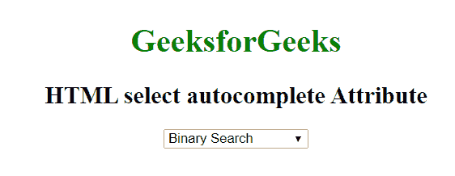

# HTML |选择自动完成属性

> 原文:[https://www . geesforgeks . org/html-select-autocomplete-attribute/](https://www.geeksforgeeks.org/html-select-autocomplete-attribute/)

**HTML <选择>自动完成属性**用于指定表单是否自动完成。当浏览器上的自动完成属性设置为时，将根据用户之前输入的值自动完成。

**语法:**

```html
<select autocomplete="on | off"> 
```

**属性值:**

*   **开:**为默认值。当浏览器上的自动完成属性设置为时，将根据用户之前输入的值自动完成。
*   **关闭:**用户应该已经为每次使用输入了每个字段的值。浏览器不应自动完成条目。

**示例:**

```html
<!DOCTYPE html>
<html>

<head>
    <title>
        HTML select autocomplete Attribute
    </title>
</head>

<body style="text-align:center">

    <h1 style="color: green;">
        GeeksforGeeks
    </h1>

    <h2>
        HTML select autocomplete Attribute
    </h2>

    <select autocomplete="on">
        <option value="binary">
            Binary Search
        </option>
        <option value="linear">
            Linear Search
        </option>
        <option value="interpolation">
            Interpolation Search
        </option>
    </select>
</body>

</html>
```

**输出:**


**支持的浏览器:**选择>自动完成属性的 **HTML <支持的浏览器如下:**

*   谷歌 Chrome
*   微软公司出品的 web 浏览器
*   火狐浏览器
*   歌剧
*   旅行队