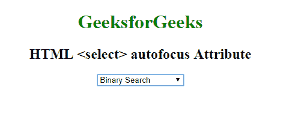

# HTML |选择自动对焦属性

> 原文:[https://www . geesforgeks . org/html-select-autofocus-attribute/](https://www.geeksforgeeks.org/html-select-autofocus-attribute/)

**HTML <选择>自动对焦属性**用于指定*下拉菜单在页面加载*时自动对焦。这是一种布尔属性。

**语法:**

```html
<select autofocus>
```

**示例:**该示例说明了在选择元素中使用自动对焦属性。

```html
<!DOCTYPE html>
<html>

<head>
    <title>
      HTML select autofocus Attribute
  </title>
</head>

<body style="text-align:center">
    <h1 style="color: green;">
      GeeksforGeeks
  </h1>
    <h2>
      HTML <select> autofocus Attribute
  </h2>
        <select autofocus>
            <option value="binary">
              Binary Search
          </option>
            <option value="linear">
              Linear Search
          </option>
            <option value="interpolation">
              Interpolation Search
          </option>
        </select>
</body>

</html>
```

**输出:**


**支持的浏览器:**选择>自动对焦属性的 **HTML | <支持的浏览器如下:**

*   谷歌 Chrome
*   微软公司出品的 web 浏览器
*   火狐浏览器
*   歌剧
*   旅行队