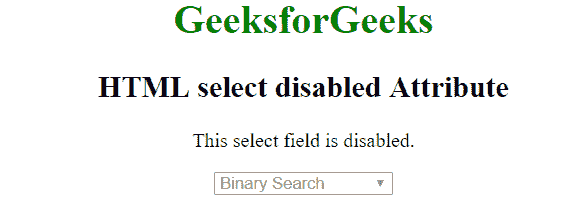

# HTML 选择禁用属性

> 原文:[https://www . geesforgeks . org/html-select-disabled-attribute/](https://www.geeksforgeeks.org/html-select-disabled-attribute/)

在 HTML 中<选择>元素的**禁用**属性用于指定选择元素被禁用。禁用的下拉列表不可点击且不可用。它是一个布尔属性。

**语法:**

```html
<select disabled>option values...</select>

```

**示例:**

```html
<!DOCTYPE html> 
<html> 
    <head> 
        <title>HTML select disabled Attribute</title> 
    </head> 

    <body style = "text-align:center">    
        <h1 style = "color: green;">GeeksforGeeks</h1>
        <h2>HTML select disabled Attribute</h2>

        <p>This select field is disabled.</p>

        <!--A disabled select-->
        <select disabled>
            <option value="binary">Binary Search</option>
            <option value="linear">Linear Search</option>
            <option value="interpolation">Interpolation Search</option>
        </select>
    </body> 
</html>    
```

**输出:**


**支持的浏览器:**选择>禁用属性的<支持的浏览器如下:

*   苹果 Safari
*   谷歌 Chrome
*   火狐浏览器
*   歌剧
*   微软公司出品的 web 浏览器