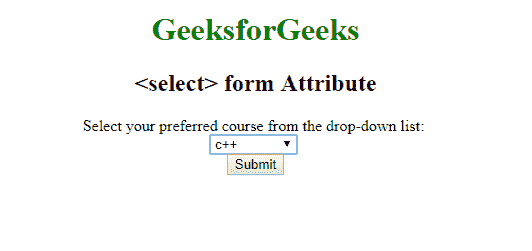

# HTML |选择表单属性

> 原文:[https://www.geeksforgeeks.org/html-select-form-attribute/](https://www.geeksforgeeks.org/html-select-form-attribute/)

**HTML <选择>表单属性**用于*指定<选择的>元素所属的一个或多个表单*。

**语法:**

```html
<select form="form_id"> 
```

**属性值:**

*   **form_id:** 它包含值，即 *form_id* ，指定选择元素所属的一个或多个。该属性的值应该是<表单>元素的 id。

**示例:**

```html
<!DOCTYPE html>
<html>

<head>
    <title>select Form Attribute</title>
    <style>
        h1,
        h2,
        .titl {
            text-align: center;
        }

        fieldset {
            width: 50%;
            margin-left: 22%;
        }

        h1 {
            color: green;
        }
    </style>
</head>

<body>
    <center>
        <h1>GeeksforGeeks</h1>
        <h2><select> form Attribute</h2> 
      Select your preferred course from the drop-down list:
        <br>

        <select form="myGeeks" id="myCourses" autofocus>
            <option value="C++">c++</option>
            <option value="Placement">Placement</option>
            <option value="Java">Java</option>
            <option value="Python">Python</option>
        </select>
        <br>
        <form id="myGeeks">
            <input type="submit">
        </form>
    </center>
</body>

</html>
```

**输出:**


**支持的浏览器:**由 **HTML <选择>表单属性**支持的浏览器如下:

*   谷歌 Chrome
*   Internet Explorer 10.0 +
*   火狐浏览器
*   歌剧
*   旅行队